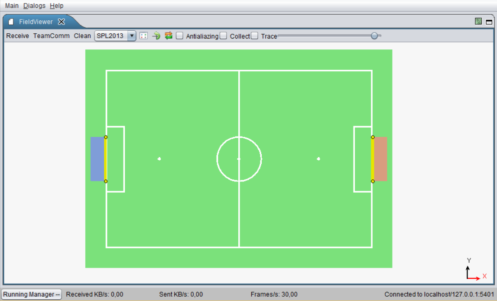
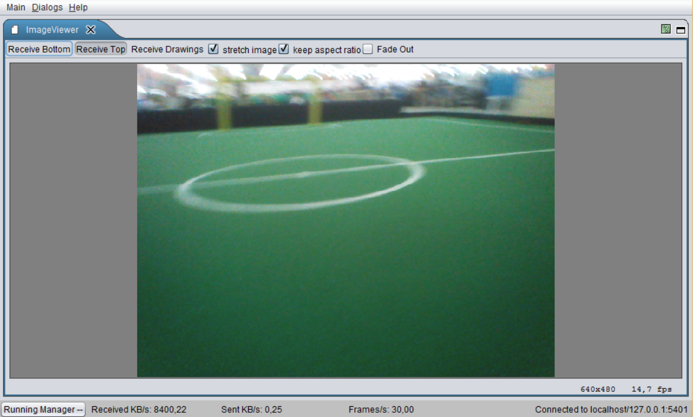
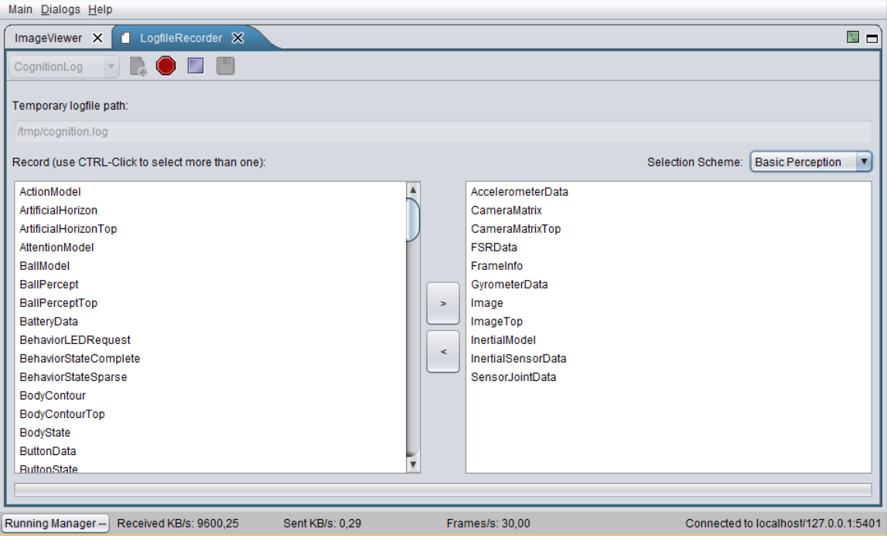
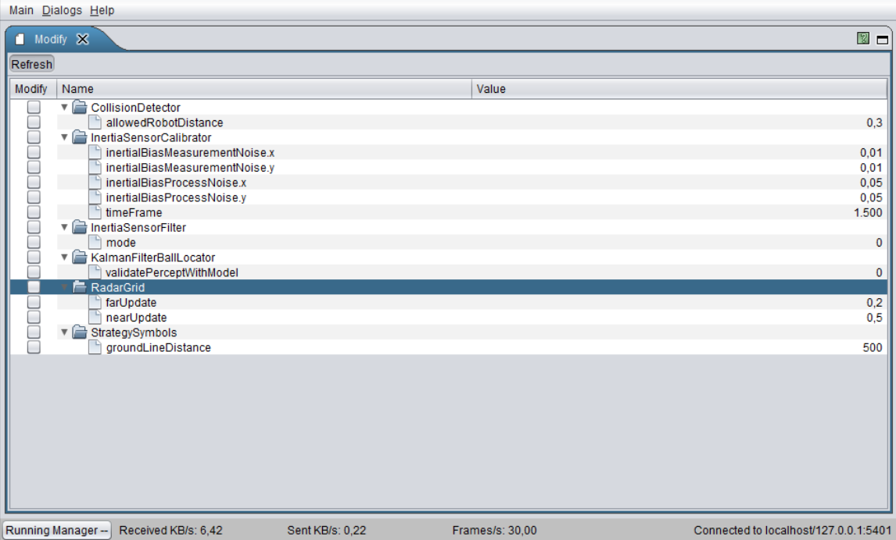
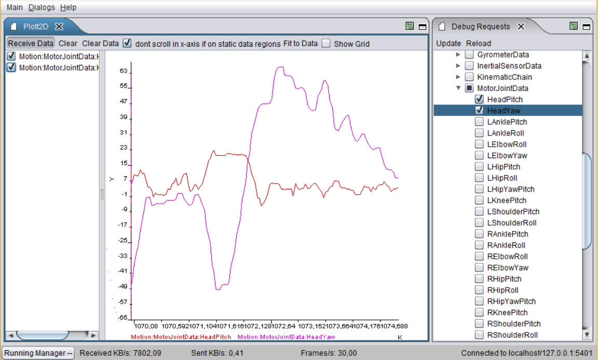
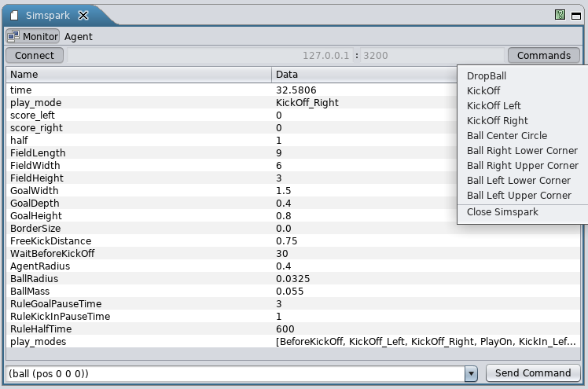
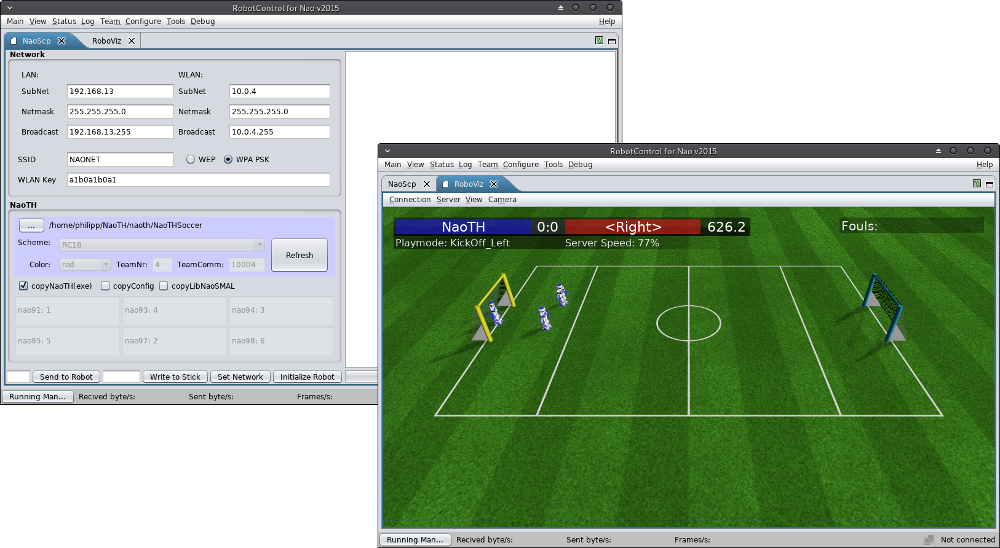
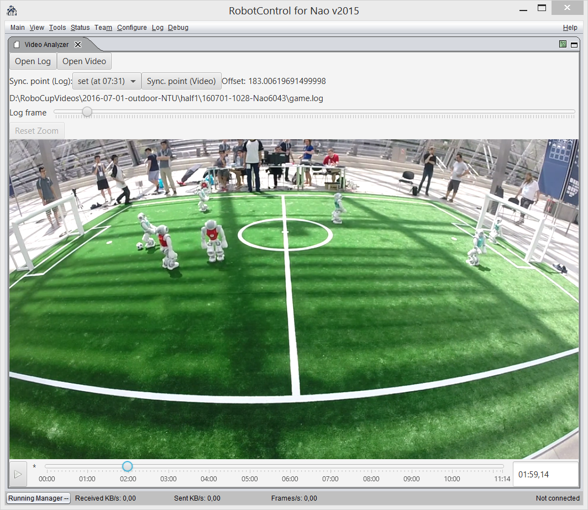

# Debugging and Tools

In order to develop a complex software for a mobile robot, we require
means for high-level debugging and monitoring (e. g., visualization of
the robot's posture or its position on the field). Since we do not
exactly know which kind of algorithms will be debugged, there are two
aspects of high importance: accessibility at runtime and flexibility.
The accessibility of the debug construct is realized based on our
communication framework. Thus, they can be accessed at runtime by using
visualization software like RobotControl, as shown in
Figure [3.1](#fig:robotcontrol){reference-type="ref"
reference="fig:robotcontrol"}.

## Concepts

Some of the ideas were evolved from the
GT-Architecture [@2007:RoboCup-TDP-GermanTeam]. The following list
illustrates some of the debug concepts:

**debug request:** (activates/deactivates code parts),

**modify:** allows modification of a value (in particular local variables)

**stopwatch:** measures the execution time

**parameter list:** allows to monitor and modify lists of parameters

**drawings:** allows visualization in 2D/3D; thereby it can be drawn into the image or on the field (2D/3D)

**plot:** allows visualization of values over time

As already mentioned, these concepts can be placed at any position in
the code and can be accessed at runtime. Similar to the module
architecture, the debug concepts are hidden by macros to allow simple
usage and to be able to deactivate the debug code at compilation time,
if necessary.

In order to use a debug request in the code you have to register it once
with the `DEBUG_REQUEST_REGISTER` macro:

```cpp
DEBUG_REQUEST_REGISTER("My:Debug:Request", "Description of the debug request", true);
```

After that, you can use the `DEBUG_REQUEST` macro to wrap code that
should be only executed when the debug request is active.

```cpp
DEBUG_REQUEST("My:Debug:Request",
    std::cout << "This code is not executed normally" << std::endl;
    ++c;
);
```

`MODIFY` works in a similar way, but does not need any registration. By,
for example, wrapping a variable and defining an identifier, this
variable can be changed later from RobotControl.

```cpp
double yaw  = 0;
MODIFY("BasicTestBehavior:head:headYaw_deg",yaw);
```

In addition to these means for individual debugging, there are some more
for general monitoring purposes: the whole content of the blackboard,
the dependencies between the modules and representations, and execution
times of each single module. The
Figure [3.1](#fig:robotcontrol){reference-type="ref"
reference="fig:robotcontrol"} illustrates visualizations of the debug
concepts. In particular a field view, 3D view, behavior tree, plot and
the table of debug requests are shown.

## RobotControl

The various debugging possibilities are organized in different dialogs.
In this year we started to update the UI by switching to JavaFX for some
dialogs. The following list consists of our most used RobotControl
Dialogs.

<figure>
  
  <figcaption>
The RobotControl program contains different dialogs. The 3DViewer (top
left) is used to visualize the current state of the robot; the Value
Plotter dialog (bottom left) plots some data; the Field Viewer dialog
(top center) draws the field view; the Behavior dialog (bottom center)
shows the behavior tree; the Debug Request Center dialog (right) is for
enabling/disabling debug requests.
</figcaption>
</figure>

### Behavior Viewer
<figure>
  
  <figcaption>
Shows the behavior tree for the current behavior. The compiled XABSL
behavior needs to be sent to the robot first and then an agent can be
selected to be executed. With 'Add Watch' you can track XABSL input and
output symbols.
</figcaption>
</figure>

### Debug Requests {#debug-requests .unnumbered}
<figure>
  
  <figcaption>
(De-)activates the debug request code. Usually a debug request draws
something on the field viewer or on the camera images. For further
information about individual debug requests, have a look at the source
code.
</figcaption>
</figure>

### Field Viewer



There are views for different field sizes and a local view. Certain
debug requests draw on these views. For example, you could draw the
robots' positions on the field by activating the corresponding debug
request.

### Image Viewer



Can show the top and bottom images. There are debug requests that draw
on the camera images, if they are active.

### Logfile Recorder



Records a log file on a robot with manually selected representations.

### Modify



The Modify macro allows changing values of variables declared within
this macro at runtime.

### Module Configuration Viewer


Shows which modules are currently (de-)activated. Also indicates, which
other modules are required (left) and provided (right) by each module.

### Parameter Panel


Shows parameters defined in our configuration files. It is possible to
change the values at runtime. The variables must be registered as
parameters in the code.

### Plot 2D



Shows plots activated by plot debug requests.

### Representation Inspector


Shows the data that is written to the blackboard by each representation.

### Stopwatch Viewer


Shows the execution time for each module.

### Team Communication Viewer


Shows all connected robots and possible all of their provided status
information via TeamComm (e.g. ip address, battery charge, temperature,
etc.). This dialog is mainly used during competitions to get a quick
overview of the robots health status, their communicated data (e.g.
ball, whistle detection, etc.) and their role decisions. Positions of
the robots, role decision and seen ball for each robot are visualized in
the
FieldViewer [\[rc:fieldviewer\]](#rc:fieldviewer){reference-type="ref"
reference="rc:fieldviewer"}. It's also useful for debugging the team
communication to get a general overview of the role decision and its
transitions. This year, the dialog was re-implemented using JavaFX.

### Team Communication Logviewer


The *Team Communication Logviewer* allows to re-play team communication
logfiles previously recorded with the *Team Communication Viewer*. It's
also able to re-play logs from the GameController and export them as
JSON.

### Simspark



This dialog shows the state of the connected simspark instance. It also
provides some predefined commands and a textfield for user-defined
commands to send to simspark. Furthermore it also provides the
teamcommunication of the simulated robots for other dialogs in
RobotControl (e.g. *Team Communication Viewer*).

### External Tools


Some "external tools" where modified in order to load them into
RobotControl via reflection. Its convenient to have all needed tools in
the application we're using most. Currently we have the NaoSCP tool (see
[3.3.2](#sec:naoscp){reference-type="ref" reference="sec:naoscp"}
NaoSCP), for the setup & deployment of a robot, and a modified version
of RoboViz, for visualization of a SimSpark simulation, integrated in
RobotControl.

## Robot Setup and Deployment

In this section we give an overview over our deployment and robot setup
procedure. Changing the configuration of the robot, e.g., deployment of
the binary, network setup etc., is a critical point during both,
development and competition. To minimize the chance of error we
developed a set of procedures and tools.

### Deployment Procedure

Currently we have two different deployment procedures:

-   deployment via usb flash drive

-   deployment via network

The general procedure consists of two steps:

1.  assemble deployment directory containing all files and
    configurations to be deployed as well as a corresponding deployment
    shell script;

2.  copy this directory to the robot and run the deployment script;

This division minimizes the chance of mistakes and allows for easier
debugging, i.e., if something went wrong, the error is either in the
locally assembled deployment directory or has occurred during the
deployment on the robot - both can be inspected separately. At the same
time this locally assembled deployment directory serves as a binary
backup, which can be very useful during the competition, e.g., if
something turned out to be wrong with the new version just before the
game and one needs to switch back to the binary from the last game.

The beginning and the end of the deployment procedure are indicated by
different sounds. This way the state of the robot and the progress of
the deployment can be easily monitored, this is especially helpful when
setting up a whole team before a game.

### NaoSCP

*NaoSCP* is a setup and deployment tool. It primarily has three tasks:
(1) initialize a new robot, e.g., copy libraries and scripts, (2) set
the network configuration and (3) deploy naoth binary and configurations
to the robot. All these tasks can be done on a command line as well, the
main aims for designing *NaoSCP* were simplification of the deployment
process, ensured backup of deployed binaries and reduction of the chance
of mistakes during setup in critical situations, e.g., before a game at
the world championship.


NaoSCP user interface. The log panel on the right displays status of
the deployment process. The left side contains the panels for the
configuration of the deployment / setup process: *Network* configures
the network setup; *NaoTH* is used to adjust the configuration relevant
for the deployed binary, e.g., player numbers. The buttons in the left
bottom tool bar trigger particular deployment and setup actions like
writing the network configuration to the robot or copying a new binary
to a deployment USB flash drive. 

#### Usage Remarks

The following describes the particular components of the NaoSCP user
interface as illustrated in the
Figure [3.2](#fig:naoscp){reference-type="ref" reference="fig:naoscp"}.

**Log Window**

(right) shows information regarding the progress of the deployment
process, e.g., copied files, connection errors and such.

**Network**

configuration (top left) is used to setup the LAN and WLAN;

**NaoTH**

dialog (left) configures the deployment of the game binary and
contains things like the path to the source where the binaries can
be found, used configuration scheme and player numbers for each
robot based on their IP address;

**Action toolbar**

(bottom left) contains the buttons for the four different deployment
/ setup actions: *Send to Robot* deploys the complied code and
configuration to a particular robot via network. The text field left
of the button defines the last byte of the ip address of the target
robot. The network configuration from the dialog *Network* is used
to determine the complete address. In this particular example the
LAN target address would be 192.168.13.82. Thereby LAN is tried
first and in case of failure WLAN is tried; *Write to stick* writes
the deployment directory to a USB flash drive. If the flash drive
already contains a deployment directory, a backup version of it is
created. The text field left to the button holds an optional tag,
which is used to organize the backups on the flash drive; *Set
Network* configures the robots network according the the settings in
the dialog *Network*; *Initialize Robot* will initialize a new
robot, e.g., after a factory reset. This action will copy additional
libs, configure the NaoQi modules, necessary starting scripts for
binaries and for automatic mounting and running of USB flash drives.
Additionally the network is configured and the binary is deployed
like previously described;

### USB flash drive

A deployment flash drive can be created manually or (as described above)
via the NaoSCP tool. As the minimum requirement there should be an
executable shell script named \"'startBrainwashing.sh\"'. When the flash
drive with a shell script (and a deployment directory) is connected to
the robot, it is mounted automatically to a defined directory and the
setup script is executed. The script is responsible for copying the
particular binary and/or configuration files. The begin and end of the
deployment procedure are indicated by different sounds. This way is
preferred when deploying software on several robots, e.g., setting up a
team before a game.

#### Flash drive variants

Currently we have different kinds of USB flash drives to accomplish
different kinds of deployment or collection tasks.

##### Deploying

As described above the deployment flash drive is used to copy new
binaries and/or configuration files to the robot.

##### Collecting log files

The \"'collect log files\"' flash drive is used to copy the recorded log
file from the robot. This is primarily used after games to be able to
analyze possible misbehavior of the robot. Otherwise, if the robot is
shut down, the log files would be lost since we record the logfiles in
main memory. In addition some informations about the robot and the
currently executed binary are collected and written to the
\"'nao.info\"' file. With that information we're documenting the state
of the robot/binary of the log file and giving a quick overview on later
log file examination. Finally we're collecting all \"'heard\"' whistles
for later fine-tuning of our whistledetector.

##### Setting network

The network flash drive is used to set the network configuration of the
robot (like IP address, etc.). Especially for the Wi-Fi configuration
this method is useful to quickly set up all need robots before a game.

## Logging

Analysis and evaluation of the algorithms running on the robot is a big
challenge.

Our team has a long history in logging (our logs from 2010 are still
readable and useful). Through the years we developed a comprehensive
infrastructure for recording log files on individual robots during the
games as well as tools for synchronizing these log files with videos of
the game and analyzing them.

A log file is recorded by a robot in its local file system, and is
collected later through network or USB (cf.
Section [3.3.3](#s:usb_stick){reference-type="ref"
reference="s:usb_stick"}). Currently we use two different modes for
recording such log files - automatic game log and log of manually
selected representations.

The game log is only recorded when the robot is in a *playing* state. It
is recorded with the cognition pace, i.e., each time a new image arrives
(each 33ms), and contains mainly the behavior state as well as
additional information needed in a particular situation. For example
during the RoboCup 2016 we recorded the best four ball candidate patches
from each image in each frame to create a database of realistic samples
for ball detection (cf.
Section [4.8.2.1](#s:ball:sample_generation){reference-type="ref"
reference="s:ball:sample_generation"}). The game logs recorded by
individual robots can be synchronized with the video of the game, which
can be very useful to analyze and find bugs in the behavior patterns of
the robot and ultimately in the team behavior.

Figure [3.3](#f:synchronisation_interface){reference-type="ref"
reference="f:synchronisation_interface"} illustrates the manual
synchronization interface. To simplify the synchronization procedure
changes in the game state, e.g., from *ready* to *play*, are
automatically extracted from the log file. The operator can select a
suitable event from a drop-down list. To synchronize both, the operator
then needs to find the corresponding time in the video. Good events for
synchronization are often changes from *init* to *ready* - in the video
one can clearly see when the robots receive the signal from the game
controller and start to move.

The manual logs can be configured and triggered through the according
control dialog in the *RobotControl* as shown in the
Section [3.2](#s:robotcontrol){reference-type="ref"
reference="s:robotcontrol"}. This is used to record specific data for
debugging or analysis in isolated experiments. A good example are log
files containing full images of particular situations for general image
processing, which can be only recorded for a short period of time due to
the large size.


Synchronization Interface for individual log files and videos of a
game.

### Logfile Format

As described in the
Section [2.3](#s:module_framework){reference-type="ref"
reference="s:module_framework"} the state of the robot is stored in
*representations* on the *blackboard*. Any of these representations can
be recorded to a log file if it has a designated serializer as described
in Section [2.4](#s:serialization){reference-type="ref"
reference="s:serialization"}. The format by which the representations
are stored in a logfile is pretty straight forward. Each representation
is stored in a package of the following form:

    <frame number><representation name><size><data>

Where `<frame number>` is 4 byte long, `<representation name>` is a
string terminated with a zero character `'\0'` and `<size>` is 4 bit
long length of the following binary `<data>`. A logfile is simply a
sequence of such packages. Important to note is that when several
different representations are recorded in each frame they are written in
the same way, so the final log looks something like this:

    1 FrameInfo ...
    1 ImageTop ...
    1 CameraMatrix ...
    2 FrameInfo ...
    2 ImageTop ...
    2 CameraMatrix ...
    ...

##### Annotate and Evaluate Logs

Annotation interface was created and used to annotate different kick
actions executed by our robots in the videos recorded during the games
at the RoboCup in 2015. The kick events were automatically extracted
from the log files recorded by the individual robots and aligned with
the video. Thus the human annotator can simply click through the
particular events and inspect them in a short time. The results were
used to evaluate the performance of the kick decision algorithm and were
published in [@RC-MellmannSchlotterBlum-16]. illustrates an example of a
labeling session for the first half of the game with the team
*NaoDevils* at the RoboCup 2015. The following two links lead to an
online demo and to the public repository with the code of the labeling
interface:  
<https://www2.informatik.hu-berlin.de/~naoth/videolabeling/index.php>
<https://github.com/BerlinUnited/VideoLogLabeling>


Labeling interface used to annotate kick events regarding their
quality. At the bottom are time lines for each of the robots. Different
actions are represented by buttons on the time line with different
colors. On the right the robots estimated state is visualized, i.e.,
estimation of its position, ball model and obstacles. On the left are
three categories of binary labels describing the quality of the
action.

## Simulation

As a common experience, there are big gaps between simulation and
reality in robotics, especially with regards to basic physics with
consequences for low level skills in motion and perception. There are
some researchers who have already tried to narrow this gap, but there
are only few successful results so far. We investigate the relationships
and possibilities for methods and code transferring. Consequences can
lead to better simulation tools, especially in the 3D Simulation League.
At the moment, we use the SimSpark simulator from the 3D Simulation
League with the common core of our program, see
Figure [3.6](#fig:spl-and-sim){reference-type="ref"
reference="fig:spl-and-sim"}. As already stated, therewith, we want to
foster the cooperation between the two leagues and to improve both of
them.


NAO robots run in Standard Platform League (left) and 3D Simulation
League (right).

When compared to real Nao robots, some devices are missing in the
SimSpark, such as LEDs and sound speakers. On one hand, we extended the
standard version of SimSpark by adding missing devices like camera,
accelerometer, to simulate the real robot. On the other hand, we can use
a virtual vision sensor which is used in 3D simulation league instead of
our image processing module. This allows us to perform isolated
experiments on low level (e. g., image processing) and also on high
level (e. g., team behavior). Also we developed a common architecture
[@Mellmann2010b], and published a simple framework allowing for an easy
start in the Simulation 3D league.

Our plan is to analyze data from sensors/actuators in simulation and
from real robots at first and then to apply machine learning methods to
improve the available model or build a good implicit model from the data
of real robot. Particularly, we plan to:

-   improve the simulated model of the robot in SimSpark,

-   publish the architecture and a version of SimSpark which can be used
    for simulation in SPL,

-   transfer results from simulation to the real robot (e. g., team
    behavior, navigation with potential field).

So far, we have developed walking gaits through evolutionary techniques
in a simulated environment [@rc-07-hein_et_al; @diplom-hein].
Reinforcement Learning was used for the development of dribbling skills
in the 2D simulation [@Uc-Cetina09thesis], while Case Based Reasoning
was used for strategic behavior
[@BurkhardBerger07Cases; @berger-laemmel-wall-pass]. BDI-techniques have
been investigated for behavior control, e. g., in
[@diplom-berger; @hdb-bound-rat].
