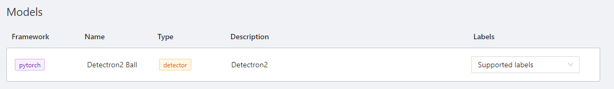
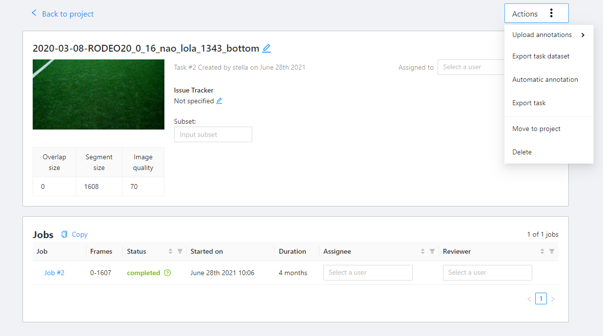

# Deep Learning Overview
Here we give an overview over the current approach to deep learning in our team.

!!! note
    TODO: create a graphic which shows the workflow

## Data sources
Currently we have two main source where image data for deep learning can come from:
- log files created on the nao robot
- gopro footage from games

In order to prepare this data for a cvat task we need to do some preprocessing. For the former we extract images and the
corresponding cameramatrix from the logs. The cameramatrix information is saved  in the png header of the image. 
Finally the images are zipped in bottom.zip and top.zip respectively. For the later  we extract and zip the frames from
the gopro footage.

!!! note
    TODO: explain the log folder structure somewhere

## CVAT Labeltool
Our CVAT instance can be accessed via <https://ball.informatik.hu-berlin.de>. The setup of our instance is described in
[CVAT Setup](../naoth_tools/cvat.md).

Everyone can register, but to see the tasks you have to be manually added to a group with the appropriate permissons.
Contact the team via slack or email to get the permissions set.

The api can be tested with swagger at <https://ball.informatik.hu-berlin.de/api/swagger/>. Alternatively you can use curl requests directly
for example like this
```bash
# get an image
curl --user <username>:<password> -X GET "http://ball.informatik.hu-berlin.de/api/v1/tasks/<task_id>/data?type=frame&quality=original&number=0" -H  "accept: application/json" -H  "X-CSRFToken: 92BgjW2DL1Q8aOWKvEFbYJubcVhbIx8jTMdypKm0KpwfXfp4NE9QW9hJxHiaP0gW" > test.png

# add an image to a task
curl --user <username>:<password> -X POST "http://ball.informatik.hu-berlin.de/api/v1/tasks/<task_id>/data" -H  "accept: application/json" -H  "Content-Type: application/json" -H  "X-CSRFToken: 92BgjW2DL1Q8aOWKvEFbYJubcVhbIx8jTMdypKm0KpwfXfp4NE9QW9hJxHiaP0gW" -d "{ \"image_quality\": 95, \"client_files\": [\"bla.png\"]}"
```

To automate many commons tasks python scripts were created in the naoth-deeplearning repo. The most relevant is the 
function for creating a task. For this you need the name of the task and the path on the server to the zip containing 
the images. A more detailed documentation can be found in the naoth-deeplearning repo.

### Label Rules
- You should not modify tasks that are assigned to someone else
- You should not modify tasks that are marked *completed*
- Do not change labels of existing projects
- Every task should belong to a project
- Notify the team via slack if your are adding tasks or projects
- Notify the team via slack before adding more automatic annotation models
- Before you start assign the task to yourself so that others don't interfere
- After you are done select *Request a review* from the menu and select another active user
- Before you start working please read the official documentation at <https://openvinotoolkit.github.io/cvat/docs>
- only label balls that you can clearly detect as balls when zoomed in a bit (TODO create some examples)
- the bounding box of a ball should include the whole ball even if part of it is outside the image or occluded
- Don't use ellipses for ball annotations yet

!!! note
    TODO: Update the rules when circle annotation is possible. Ellipses are not useful for us right now.

### Rules for GoPro Tasks
Starting in 2018 we tried to record every SPL game with a camera outside of the field. The videos can be found at logs.naoth.de

You should not import the Gopro videos directly. Instead the functions inside the NaoTH-Deeplearning repo for everything.

!!! note
    TODO: what should the labels be???
    TODO: mention that labels should be done in projects not tasks

### Rules for Log Tasks
!!! note
    TODO: write down the annotations that dortmund does. its important to know where the robot is blurred, fully in the
    picture etc.

### Auto Annotation for users
You can see a list of available models by clicking Models View on the top:


By clicking on supported labels you can see a list of labels this model can annotate. To create new models see the documentation at
[CVAT Setup](../naoth_tools/cvat.md).

Navigate to a task and click `Actions->Automatic annotation` and select the model you want to run.
  
Now you have to wait for a long time. After all images of the tasks are done you can see the created annotations.

!!! note
    Those models are not able to do proper annotations (e.g. blurrendness) for bounding boxes yet. 
    Those still have to be done manually.

## Training a model
TODO

## Deploying a model
TODO
