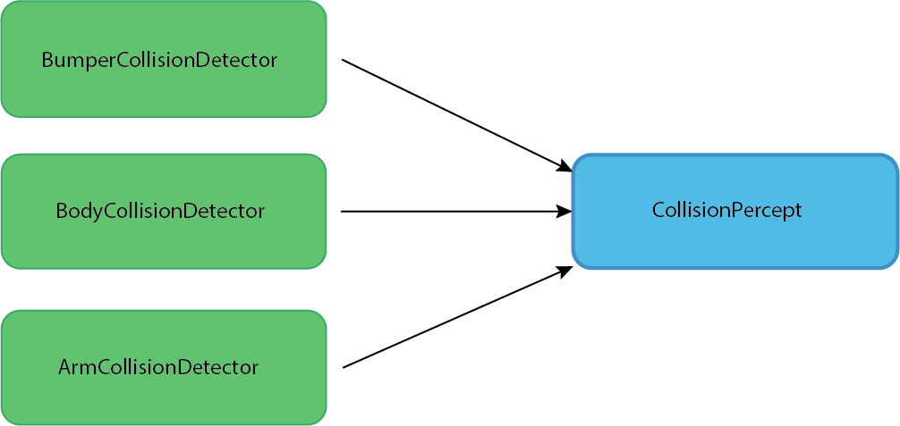
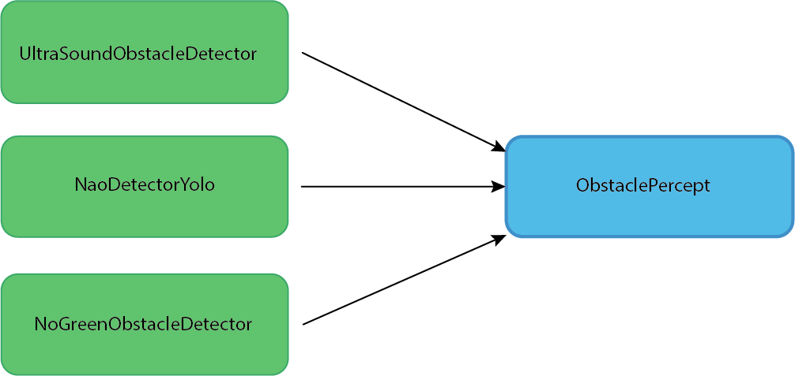

# Obstacle Detection and Pathplanning
Pathplanning for a single robot is easy as long as there are no obstacles to move around. In our case pathplanning can
be challenging due to the dynamic nature of the robots on the field. There are multiple ways to detect obstacles. First
we can detect if we are pushed or not able to move as expected. Then we can detect obstacles from further away with the 
ultrasound sensors or by detecting robots and other obstacles elements in the image. We can also take the broadcasted 
positions of our teammates into account.

## Collision Detection
We have three different methods to detect collisions. The `ArmCollisionDetector` module detects wether the arm movements
are blocked. In this case we try to move our arms back to reduce the width of the robot.

The `BumperCollisionDetector` module detects if the bumper on the feet are pressed for a period of time. This happens 
when the robots walks into a fallen robot or agains a goalpost.

The `BodyCollisionDetector` module detects wether the robot was pushed. 

## Obstacle Detection
- Ultrasound
- NoGreenDetection
- Robot Detection via Deep Learning

## Modeling the obstacles

## Pathplanning
TODO: steffen