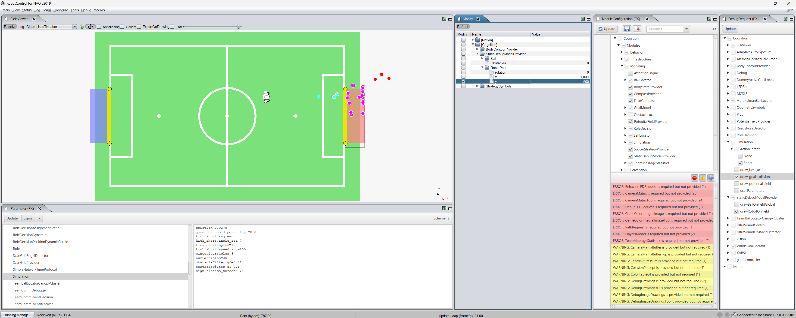

# Action Selection
- Connect RobotControl to a roboter or LogSimulator or DummySimulator, it does not matter which runtime you use.
- In the ModuleConfiguration Panel enable the Cognition->Modeling->StaticDebugModelProvider module. This will overwrite the ball position and the robot position on the field
- In the DebugRequest tree enable drawRobotOnField in StaticDebugModelProvider and the kicks in the Simulation->ActionTarget 
- In the Fieldviewer click receiver
- If you use a Simulator the default scheme NaoTHLabor will be used and all decisions are based on those field dimensions.
- You can change the ball position and the robot position in the Modify Panel
- The Action Selection Parameter can be changed in the Parameter Panel, to see the effect you need to enable the useParameters DebugRequest.

If everything is set up correctly it looks like this in robotcontrol

The individual simulations are colored based on where they end up. Red for outside the field, magenta for inside the opponent goal and cyan for inside the field.