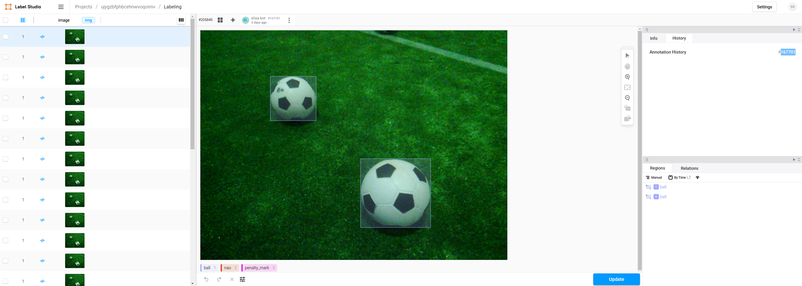

# Data Prep for Deep Learning
We use Labelstudio [https://labelstud.io/](https://labelstud.io/) for all annotation tasks. It's deployed to our k8s cluster. Our instance is available at [https://ls.berlinunited-cloud.de/](https://ls.berlinunited-cloud.de/). For more information about the deployment part see the [k8s docs](../../naoth_tools/k8s.md).

We largely automated the data ingestion process from the point of uploading the data to our server.

!!! note
    finds new data in the log folder -> adds data to a postgres db -> if images are not already extracted from log, extract them -> add information about image location to db -> if images not already present in labelstudio add them there -> if images not annotated, run annotation model.

In the following sections this process is described in more detail. Please note that you don't have to run the automation. You can always do everything manually. But for reproducibility this is not advised. The code for the whole data prep process is in [https://scm.cms.hu-berlin.de/berlinunited/projects/log-crawler](https://scm.cms.hu-berlin.de/berlinunited/projects/log-crawler)


## Logfolder Structure
Internally we have a file server that you can access via any gruenau server. The logs are located at `/vol/repl261-vol4/naoth/logs`. Externally this folder is accessable via [logs.naoth.de](logs.naoth.de). Please see the page about infrastructure for more information.

```txt 
logs/
    2015-07-17_RC15/
    2016-01-16_MM/
    ...
    2018-06-16_RC18/
        2018-06-18_15-00-00_Berlin United_vs_Austin_half1/
        2018-06-18_15-00-00_Berlin United_vs_Austin_half1-to1/
            ** if there was a timeout or its a test or something else the comment of the game should be part of the halftime string. that way game_name.split("_")[5] is the name of the game part
            **[eine Auszeit (TimeOut) ist ein normaler Spielabschnitt, entsprechend enthält er alle Daten wie eine normale Halbzeit]**
        2018-06-18_15-00-00_Berlin United_vs_Austin_half1-to2/
            **[2. Auszeit]**
        2018-06-18_15-00-00_Berlin United_vs_Austin_half2/
            extracted/
                1_91_Nao0379/
                2_97_Nao0075/
                3_94_Nao0338/
                4_96_Nao0377/
                5_95_Nao0225/
                    **[generierte Daten]**
                    log.json
                gc.json
                videos.json
            game_logs/
                1_91_Nao0379/
                2_97_Nao0075/
                3_94_Nao0338/
                4_96_Nao0377/
                5_95_Nao0225/
                    **[via Log-Stick gesammelte Daten]**
                    config.zip
                    game.log
                    nao.info
                    patch_labels.json  
                    ...
            gc_logs/
                    teamcomm_2018-06-18_15-16-19-611_UT Austin Villa_Berlin United_2ndHalf_initial.log
                    teamcomm_2018-06-18_15-21-23-346_UT Austin Villa_Berlin United_2ndHalf.log
                    teamcomm_2018-06-18_15-21-23-346_UT Austin Villa_Berlin United_2ndHalf.log.gtc.json
                    teamcomm_2018-06-18_15-32-25-912_UT Austin Villa_Berlin United_2ndHalf_finished.log
            videos/
                    half2.LRV
                    half2.MP4
                    half2.url
                        **[enthält einen Link/URL auf ein Video, z.B.: https://www.youtube.com/watch?v=0R39kqXO_KE]**
        2018-06-18_15-00-00_Berlin_United_vs_Austin_half2_penalty/
            **[Elfmeterschießen (Penalty Shootout) ist ein normaler Spielabschnitt, entsprechend enthält er alle Daten wie eine normale Halbzeit]**


Ein kleiner Kommentar (bestehend aus 1/2 Worten kann durch ein "-" getrennt an das Event, das Spiel oder den Log-Ordner angehängt werden:
logs/
    2018-06-16_RC18-prepare/
        2018-06-18_15-00-00_Berlin United_vs_Austin_half1-test/
        2018-06-18_15-00-00_Berlin United_vs_Austin_half2-test/
            game_logs/
                1_91_Nao0379-after-failure/
```


## Data sources
Currently we have two main source where image data for deep learning can come from:
- log files created on the nao robot
- gopro footage from games

In order to prepare this data for a cvat task we need to do some preprocessing. For the former we extract images and the
corresponding cameramatrix from the logs. The cameramatrix information is saved  in the png header of the image. 
Finally the images are zipped in bottom.zip and top.zip respectively. For the later  we extract and zip the frames from
the gopro footage.

!!! note
    TODO: explain the log folder structure somewhere

## Validate Auto Annotation
As described before the actual annotating should be done automatically. But we still have to validate the annotations. Just click on each row and have a look if the annotations are correct. Don't skip any row as the preview images can hide some details. If you need to make changes you have to click the blue update button, otherwise changes are not persisted.



### Set relations between bounding boxes.
We often have situations where the bounding box of a robot and the bounding box of the ball overlap. In this case it is useful to note which bounding box is in front. You can do that with the [relation feature from labelstudio](https://labelstud.io/guide/labeling.html#Add-relations-between-annotations). You have to click first on the bounding box that is in front, then click the hyperlink icon and then on the bounding box that is in the background.

After that you have to set the name for the relation.


### Propagate Annotations
Sometimes we have logs where the auto annotation failed but nothing is moving for a while. In this case propagating the annotations from the first frame to a later one is useful. In this case annotate the first one as usual. Then select each frame that should have the same annotation and then click "Propagate Annotation". You need to set the annotation ID you want to propagate in the pop up window. You can find that when opening the first frame in history windows on the left side.

Note: This is an experimental labelstudio feature.

### Mark a Project as done
TODO: explain how to mark a project as done.