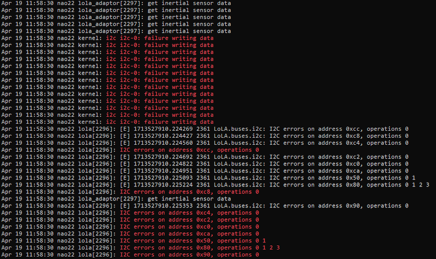

# Known Issues with Robots 

## LOLA: Failure Writing Data

This error seems to accur sometimes after the robot comes back from being repaired when use a custom OS on the NAO.

### Symptoms
Cognition is started, LEDs are working, but the robot is unable to move the joints.

### Analysis
1. login through SSH
2. run `journalctl`
3. the output should be showing following repeating error messages 

### Reason

The reason seems to be a version-mismatch between the firmware of the joints and the communication protocol of the LOLA in the custom OS.

### Solution

1. flash an original Aldebaran OpenNao OS
2. flash the custom OS again

 