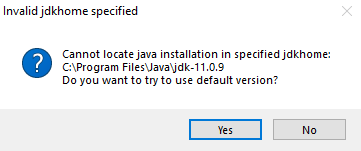

# NaoTH Development Setup

## Prerequisites

You need to install a bunch of software before being able to develop code for the Nao robot.

=== "Linux"

    In Linux you need the following dependencies: cmake, gcc and g++ compiler, zlib, qtcreator, git, gettext, java, netbeans, libreadline-dev
    
    gettext is for compiling glib  
    libreadline-dev is needed for our LUA experiments.  

    We support Java 8 and 11+.  
    For the VideoAnalyzer-Dialog in RobotControl it is potentially necessary to install `ffmpeg-compat-55` package (Arch) see
    [here](https://wiki.archlinux.org/index.php/java#JavaFX.27s_MediaPlayer_constructor_throws_an_exception)

    You can install them in ubuntu with this:
    ```sh
    # java
    sudo apt install default-jdk openjfx netbeans
    # c++ compile
    sudo apt install build-essential cmake 
    # c++ essential libs
    sudo apt install zlib1g-dev libreadline-dev
    # c++ IDE (qtcreator)
    sudo apt install qtcreator qt4-qmake libqt4-dev 
    # code versioning control
    sudo apt install git
    # for glib
    sudo apt install gettext
    # for archives in the toolchain repo
    sudo apt install unzip
    # for creating an ubuntu image for the nao
    sudo apt install pigz debootstrap
    ```

    ??? "Optional Step (Cmake GUI)"
        You may want to install the cmake GUI for easier development. For example with `apt install cmake-curses-gui` after
        installation run ccmake instead of cmake.

        You can also use the QT GUI by installing `sudo apt install cmake-qt-gui` and running cmake-gui after.
    
    ??? "Optional Step (Clang)"
        If you want to use clang instead of gcc you need to install the `clang`, `llvm` and `lld` packages. 
        The following snippets are specific for Ubuntu-20.04. For other operating systems they need to be modified.
        ```
        sudo apt install clang llvm lld
        ```
        In Ubuntu 20.04 clang-12 is installed with the above command however the binaries are not recognized without the version
        suffix. To fix this setup the symlinks for the commands like this.
        ```
        sudo ln -sf /usr/bin/clang-12 /usr/bin/clang
        sudo ln -sf /usr/bin/clang++-12 /usr/bin/clang++
        sudo ln -sf /usr/bin/llvm-ar-12 /usr/bin/llvm-ar
        ```
        You can also install clang 13, 14 and 15 like this:
        ```
        wget -O - https://apt.llvm.org/llvm-snapshot.gpg.key|sudo apt-key add -

        sudo add-apt-repository "deb http://apt.llvm.org/focal/ llvm-toolchain-focal-13 main"
        sudo add-apt-repository "deb http://apt.llvm.org/focal/ llvm-toolchain-focal-14 main"
        sudo add-apt-repository "deb http://apt.llvm.org/focal/ llvm-toolchain-focal-15 main"
        
        sudo apt update --allow-insecure-repositories
        
        sudo apt install clang-13 lld-13 llvm-13
        sudo apt install clang-14 lld-14 llvm-14
        sudo apt install clang-15 lld-15 llvm-15
        ```
        After this setup the symlinks as done above. This documentation is taken from [https://apt.llvm.org/](https://apt.llvm.org/)


=== "Windows"

    **Visual Studio**  
      - Install Microsoft Visual Studio 2019 Community Edition from [https://visualstudio.microsoft.com/vs/community/](https://visualstudio.microsoft.com/vs/community/) 

      - **Note:** The project is optimized for VS2019 it is therefore recommended to use it.
      - **Configure:** After a fresh installation you should adjust following configurations
        - change tab size and indent size to 2 and enable "Insert Spaces" here  ``Tools->Options->Text Editor->C++->Tabs``
        - enable the "Build"-toolbar (right klick on the top toolbar) 

    **Cygwin**  

      - Get [cygwin](http://www.cygwin.com)
      - Install cygwin, for example to `C:\cygwin`  
        - **Required**: Select the package *make* for installation
        - **Required**: Install the *mintty: Terminal emulator with native Windows look and feel* shell package.  
        - **Optional**: To add mintty to the windows context menu you have to install the cygwin chere package and execute 
          `chere -i -t mintty -s bash` in  a cygwin console with admin privileges. You are now able to right click and open a mintty bash console in any folder.

    **Java**  
    You need at least Java JDK 8. Normally you need a oracle account for downloading the jdk. Or you can use the 
    following workaround taken from [here](https://gist.github.com/wavezhang/ba8425f24a968ec9b2a8619d7c2d86a6)

      - Select the JDK you want from https://www.oracle.com/java/technologies/javase-downloads.html  
      - Click on a link like `jdk-8u291-windows-x64.exe`. This will open a popup.   
      - Copy the link in the popup. It should be something like https://www.oracle.com/webapps/redirect/signon?nexturl=https://download.oracle.com/otn/java/jdk/8u291-b10/d7fc238d0cbf4b0dac67be84580cfb4b/jdk-8u291-windows-x64.exe  
      - change this link to https://download.oracle.com/otn-pub/java/jdk/8u291-b10/d7fc238d0cbf4b0dac67be84580cfb4b/jdk-8u291-windows-x64.exe  
      - This is the download link you can use to download the jdk.  
      - Install the jdk
    
    **NetBeans**  

      - Get [NetBeans](https://netbeans.org/downloads/index.html) and install it  
      - **Important**: Make sure that your Java Path is properly set before installing, otherwise it won't work!  

    **Clang**

    You can use clang for cross compiling for the NAO. For that install a recent LLVM version from [here](https://github.com/llvm/llvm-project/releases). 
    For example choose [LLVM-14.0.6-win64.exe](https://github.com/llvm/llvm-project/releases/download/llvmorg-14.0.6/LLVM-14.0.6-win64.exe)

## Toolchain Setup
=== "Linux"

    Clone the toolchain repo from either our [internal gitlab](https://scm.cms.hu-berlin.de/berlinunited/tools/linuxtoolchain)
    or [public github](https://github.com/BerlinUnited/linuxtoolchain). In this docu to the path of the cloned repo is called
    `<NaoTH-Projekt/toolchain>` Obviously on your system the path looks different.  

    Both repos are synced but the development only happens in the internal repo.

    TODO: add missing parts here

    TODO: how to compile NaoSmal??? You need the naoqi toolchain in AL_DIR

=== "Windows"

    Clone the toolchain repo from either our [internal gitlab](https://scm.cms.hu-berlin.de/berlinunited/tools/windowstoolchain)
    or [public github](https://github.com/BerlinUnited/windowstoolchain). In this docu to the path of the cloned repo is called
    `<NaoTH-Projekt/toolchain>` Obviously on your system the path looks different.

    Both repos are synced but the development only happens in the internal repo.

    Inside `<NaoTH-Projekt/NaoTHToolchain>` run `setup.bat` as admin.

    This script will generate `projectconfig.user.lua` which must be copied `<NaoTH-Projekt/Naoth-2020>/NaoTHSoccer/Make`.
    This is later used for configuring the compile step if needed.

    TODO: how to compile NaoSmal??? You need the naoqi toolchain in AL_DIR


## Clone and build
To work with the project, checkout the git repo:
```sh
git clone <url of this repo> <NaoTH-Projekt/Naoth-2020>
```
where `<NaoTH-Projekt/Naoth-2020>` is the desired path to the repository on your machine.

=== "Linux"

    1. TODO

=== "Linux Crosscompilation"

    There are two ways to compile the naoth source code for the NAO. First you can target the softbank provided
    image for the NAO or use clang and target the self build Ubuntu image.

    #### Softbank Image
    In order to build the naoth binary go to `<NaoTH-Projekt>/Naoth-2020/NaoTHSoccer/Make` and run `./compileGame.sh -j 4`

    #### Clang + Ubuntu Image
    You need to have LLVM installed as described above in the prerequisites section.

    To tell premake to use the ubuntu toolchain you need to change two lines `<NaoTH-Projekt>/Naoth-2020/NaoTHSoccer/Make/projectconfig.user.lua`

    ```lua
    NAO_CTC="<NaoTH-Projekt/NaoTHToolchain>/toolchain_nao_ubuntu/"
    if PLATFORM == "Nao" then
        _OPTIONS["crosscompiler"] = "clang"
    end
    ```


    In order to build the naoth binary go to `<NaoTH-Projekt>/Naoth-2020/NaoTHSoccer/Make` and run `./compileGame.sh -j 4`

    TODO: mention lolaadaptor and naosmal compilation

=== "Windows"

    Go to the `<NaoTH-Projekt/Naoth-2020>/NaoTHSoccer/Make` directory and execute `generate-vs2019.bat` to 
    create Visual Studio 2019 project files `<NaoTH-Projekt/Naoth-2020>/NaoTHSoccer/build/vs2019`
    
    Open the NaoTHSoccer.sln file with Visual Studio and you have all the projects loaded that are needed for compilation.
    You can now build each project by right clicking on it and then clicking on build.

=== "Windows Crosscompilation"

    There are two ways to compile the naoth source code for the NAO. First you can use cygwin and target the softbank provided
    image for the NAO or use clang and target the self build Ubuntu image.

    #### Cygwin + Softbank Image
    You need to have cygwin installed as described above in the prerequisites section.

    In order to build the naoth binary go to `<NaoTH-Projekt>/Naoth-2020/NaoTHSoccer/Make`, open the mintty bash console in
    this folder via the context menu and run `./compileGame.sh -j 4`

    #### Clang + Ubuntu Image
    You need to have cygwin and LLVM installed as described above in the prerequisites section.

    To tell premake to use the ubuntu toolchain you need to change two lines `<NaoTH-Projekt>/Naoth-2020/NaoTHSoccer/Make/projectconfig.user.lua`  

    - NAO_CTC=<NaoTH-Projekt/NaoTHToolchain>/toolchain_nao_ubuntu  
    - _OPTIONS["crosscompiler"] = "clang"

    In order to build the naoth binary go to `<NaoTH-Projekt>/Naoth-2020/NaoTHSoccer/Make`, open the mintty bash console in
    this folder via the context menu and run `./compileGame.sh -j 4`

    TODO: mention lolaadaptor and naosmal compilation

---
For development inside WSL follow the linux instructions.

## Additional tools for development
We use different tools with our project:

**XabslEditor**  
We have a dedicated editor for editing and compiling the robots behavior written in xabsl.
  - clone: `git clone https://github.com/BerlinUnited/xabsleditor.git`  
  - load the Netbeans project from `xabsleditor` and run the application  
  - manual (after the project was loaded once with netbeans):  
    - change dir `cd xabsleditor`  
    - compile: `./gradlew.bat clean build`  
    - run: `./gradlew.bat run` or `./dist/xabsleditor.bat` or `java -jar dist/lib/xabsleditor-1.2.jar`  
 
**RobotControl**  
  - For controlling, modify and analyze the nao robot
  - load the Netbeans project `RobotControl` and run the application
    - File->Import Project `<ProjectDir>`/RobotControl
  - manual:
    - compile: `./gradlew.bat clean build`
    - run: `./gradlew.bat run` or `./dist/robotcontrol.bat` or `java -jar dist/lib/RobotControl.jar`
 
**NaoSCP**  
See NaoSCP Documentation
 
**Simspark**  
  - to run a simulated version of our naoth project  
  - check the [Simspark Setup Guide ](Simspark-Windows-Setup) for installation instructions  
 
**Python**   
For working with logfiles we have a set of python scripts in the `utils/py` folder. The basic functionality is inside a the naoth python package which you can install with pip:    
   - run `pip install -e naoth` in the `<repository>/Utils/py` this will install protobuf as well 

## Known Issues
**Premake5 is not found**  
  - can happen if your PATH is exceeding the 1024 character limit if PATH is set with setup.bat
  - Solution add it manualy to the Path. Note that trying to append to PATH with the setup.bat script can delete the 
    last characters until the string that should be appended fits. In this case other paths are corrupted and don't work anymore.

**RobotControlGUI, NaoSCP and the xabsl editor don't scale correctly for high resolution displays**  
  - to fix this install java jdk 11+

**Java 11:**  
Java FX is not part of Java 11. It must be installed separately.

**Netbeans does not find java:**  


Solution: Edit the netbeans.conf file. It's located inside the install directory. For example 
`C:/Program Files/NetBeans-12.0/netbeans/etc/netbeans.conf`. Set `netbeans_jdkhome` to the java jdk dir. 
For example: `netbeans_jdkhome="C:\Program Files\Java\jdk1.8.0_271"`
