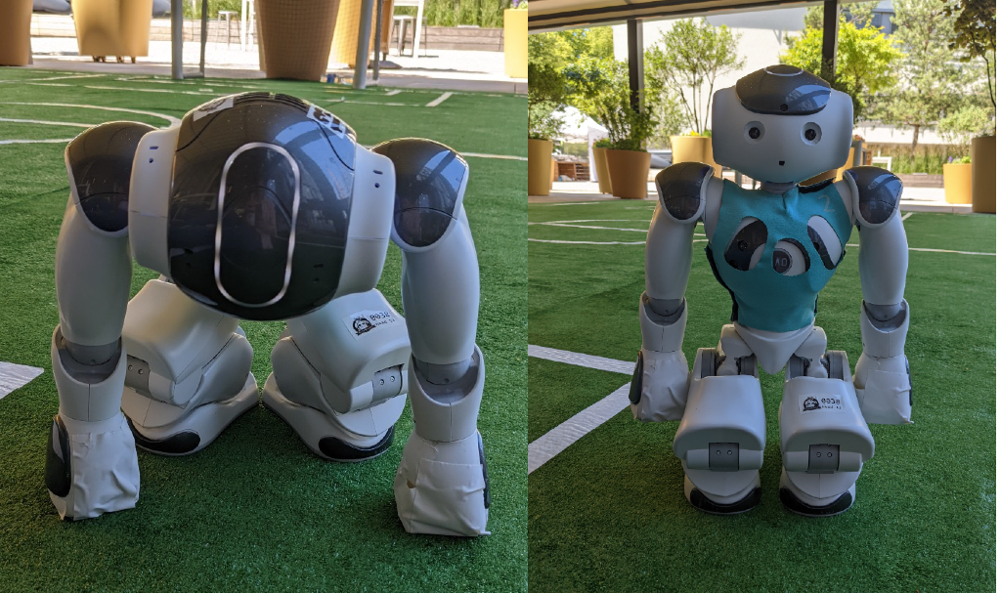

# NAO setup and deployment
Before you can deploy the NaoTH Code to the robot needs to be set up in a special way. This is a one time setup which 
replaces the operating system that comes with the robot and additionally sets up some libraries we need on the robot. 

## Old Setup Routine
First we need to setup the operating system with the image provided by softbank robotics. You can download it from 
[here](https://www2.informatik.hu-berlin.de/~naoth/ressources/Softbank/nao-2.8.5.11_ROBOCUP_ONLY_with_root.opn)

This image must be put onto a usb drive. For this you can use the [Nao Flasher](http://doc.aldebaran.com/2-8/software/naoflasher/naoflasher.html?highlight=naoflasher) tool provided by softbank.
In order to flash the robot, make sure the robot is turned off then insert the usb stick and press the chest button until the blue chest LED's blink. The flashing will take a couple minutes.

The robot should be in the monkey pose during the flash process. After this is finished you can set the robot upright. It will then
stand up and calibrate (BUT WHAT EXACTLY???). During the calibration the robot must stand on an even surface.

  
Left: monkey pose. Right: sit pose

The next step is to initialize the robot with the required libs. This can be done with NaoSCP and is described [here](../../naoth_tools/naoscp.md)

## New Setup Routine (with custom image)
The first two steps will be done with a custom image.

---
## Deploy Code to robot
TODO: explain network stick  
TODO: explain deploy stick  
TODO: explain deploy routines?

