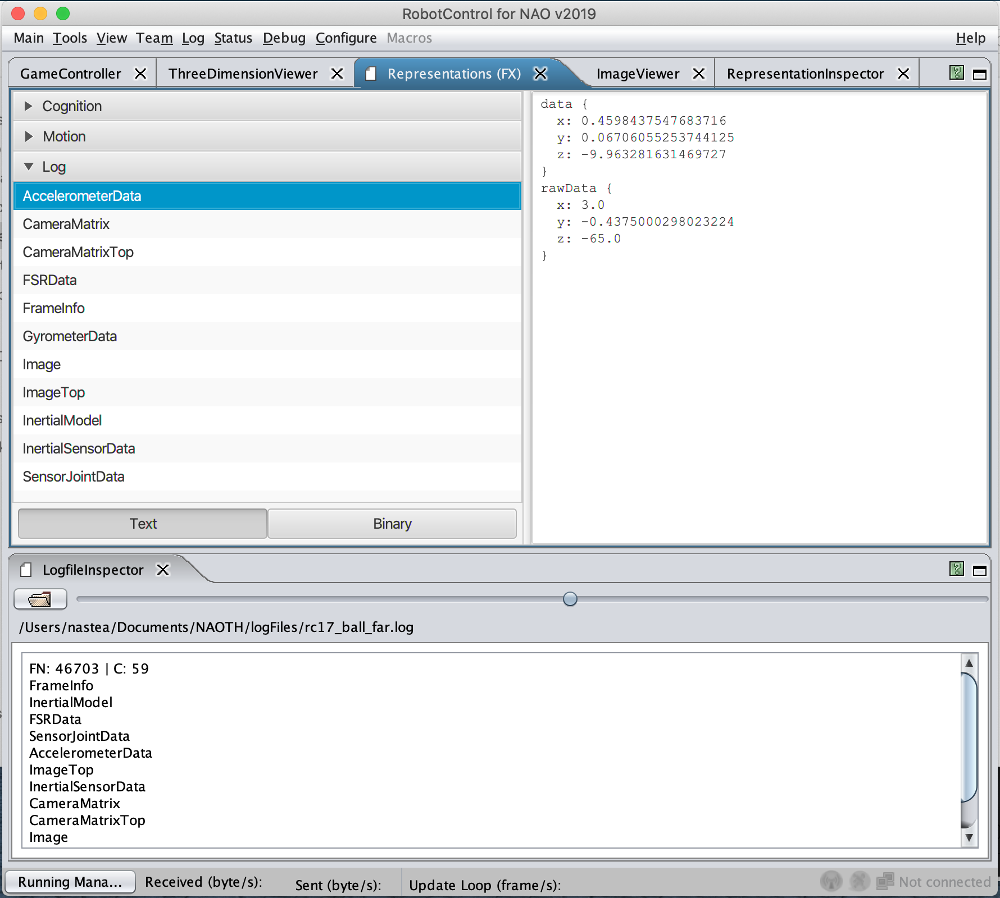
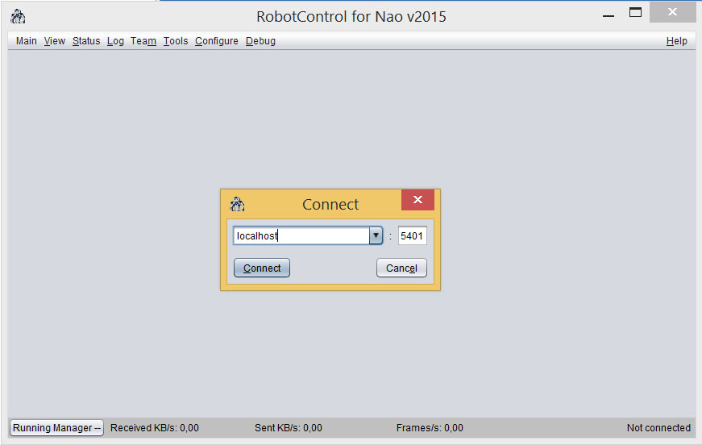
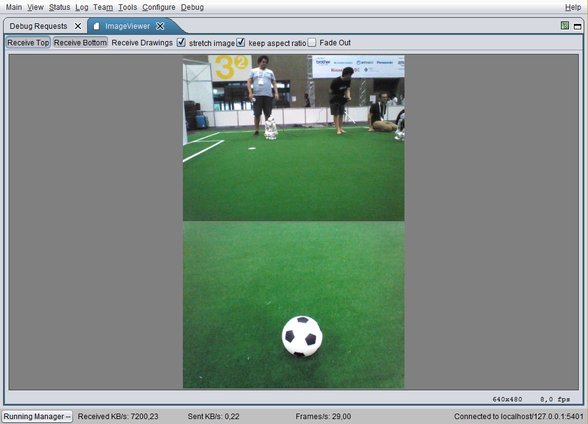
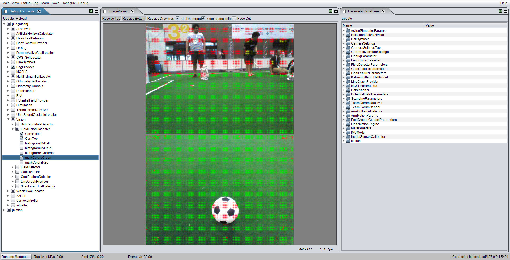

**Prerequisites:**  
- You should be able to compile the Commons, NaothSoccer and LogSimulator projects on your system  
- You can run RobotControl  

# 1 Get access to logfiles

There are two ways to access the folder with the logfiles and videos of our games and tests. 

1. You can get **read-only** access to the logs (without the need of the ssh access) at

   ```
   https://logs.naoth.de/
   ```

2. You can get access to the university's server or any other gruenau server via ssh: 

   ```
   ssh naoth@gruenau6.informatik.hu-berlin.de
   ```

   The logfiles are located under 
   ```
   /vol/repl261-vol4/naoth/logs
   ``` 

   In order to be able to log in as user naoth your public ssh key has to be registered 
   in the `authorized_keys` file of the user naoth. Every teammember who already has 
   access to the naoth user can add you to the list located in 
   ```
   /vol/home-vol1/wissen/naoth/.ssh
   ```

   For Linux use `ssh-keygen` and on Windows use cygwin's ssh-keygen. 
   Send your public key to a teammember who can add your key.


# 2 Work with logfiles in RobotControl
## Run a logfile in the LogSimulator

For this tutorial use the following file
*  https://logs.naoth.de/2017-08-RC17/logs/far_ball_issue/rc17_ball_far.log

Download a logfile and start the LogSimulator in Debug with the name of the logfile as argument. In the Console window you can press p to play the logfile and l to loop the logfile. More Controls for the LogSimulator are displayed in the console window.

## Start RobotControl

A detailed description of the RobotControl can be found in the [Teamreport](https://www2.informatik.hu-berlin.de/~naoth/docs/publications/technical/naoth-report16.pdf).
There are multiple ways to start RobotControl:

1. Open **NetBeans**, create a `new project`, choose the `RobotControl folder`, press `Build` and then `Run`.

2. In the **terminal**:
   ```
   cd naoth-2020/RobotControl
   ./granlew 
   ```
   or 
   ```
   cd naoth-2020/RobotControl/dist
   ./robotcontrol
   ```
   or 
   ```
   cd naoth-2020/RobotControl/dist/lib
   java -jar RobotControl.jar
   ```
   **Note**: The presented examples for running shell scripts work for macOS and may be different for another OS.

3. In the `Finder`, go to `naoth-2020/RobotControl` and double-click the `granlew` script. Same for the `robotcontrol` script located in `naoth-2020/RobotControl/dist`.


## View Representations in RobotControl

### Logfile Inspector
Depending on what you want to do with the logfiles, you can view them in different ways. If you want to check if the logfiles contain any data and quickly look through it, you can use the `Logfile Inspector`, which gives you the possibility to view the data (e.g. images, sensor values) in RobotControl:

1. Open RobotControl and go offline (disconnect from any host). Uncheck the checkmark under `Main -> Enforce Connection`, otherwise you will be prompted to connect to a host every time you open a new dialog.

2. press `Alt+F` (or `Option+F` for mac)

3. search for `Inspector'

4. drag the 'LogfileInspector` window to the bottom of the RobotControl window (for convenience)

5. Drag and drop the logfile you want to view into the 'LogfileInspector` window

6. For viewing images go to `View -> Image` and press `Receive Top` and/or `Receive Bottom`, depending on which camera you are interested in. You can scroll through the frames by moving left and right the bar highlighted in the picture:
{.center .medium}

7. To view sensor data other than images, press `Alt+F` again and search for `Representations (FX)` (or go to `Status -> Representations (FX)`).

8. Press the `Log` tab and choose the sensor data you want to view:


### LogSimulator

If you want to run robot code on the logfile, you should create a robot instance by starting the `LogSimulator` in the terminal, playing the logfile, and connecting RobotControl to your localhost. In this way the logfile is basically acting like a real robot, which you can observe and program via RobotControl.

1. Start the `LogSimulator`:
   ```
   cd NaoTHSoccer
   ./dist/Native/logsimulator /path/to/log/file/game.log
   ```

2. While the logfile plays, press `Ctrl + K` to connect to localhost with RobotControl. 
   The port needs to be `5401` for the LogSimulator.   
   

3. Open the image dialog by clicking `View -> Image`. Then press `Recieve Top` or 
   `Recieve Bottom` for choosing the top or the bottom camera of the robot.
   

4. Go to `Status -> Representations` to view data besides the actual images.

5. Additional information can be drawn on top of the images by enabling certain 
   Debug Requests via the `Debug -> DebugRequest` Dialog. Such information can 
   be the position of the ball in the image or pixel classified as green.
   

   In the image above the DebugRequests for showing the green pixels are enabled 
   (on the left). On the right side of the image the ParameterTreePanel is shown. 


# 3 Work with logfiles in python

## 3.1 Python Ecosystem

All python ecosystem is located in the directory 

```sh
<naoth-2020 repository path>/Utils/py
```

1. install `naoth`package

   run the following command to install the `naoth`package
   ```sh
   pip install -e naoth
   ```

   For more information read
   ```
   <naoth-2020 repository path>/Utils/py/README.md
   ```

2. *[optional]* Generate the protobuf messages inside the `Make` folder:
Usually all necessary generated messages are contained in the repository. 
This step is necesary if message files were chaned (*need a reference here*)
   ```
   cd naoth-2020/NaothSoccer/Make
   ./premake5 --protoc
   ```

   **NOTE:** The python messages are saves in `Utils/py/naoth/naoth/pb`. If you don't have the up-to-date messages, the logs can't be parsed. 


## 3.2 Example Logfile

For our examples we use the following logfile
```
https://logs.naoth.de/2019-07-02_RC19/2019-07-04_11-00-00_Berlin%20United_vs_NaoDevils_half1/game_logs/3_93_Nao0212_190704-1112/game.log
```
We assume, that the logfile is named `game.log` and is placed in the same directory as your scripts.

## 3.3 Logfiles structure

A logfile consists of **frames** and each frame contains **representations**, 
which hold various data recorded from the robot. Such data can be Images, 
Ball detections etc. Each Frame has a number increasing from 0. The representations 
can be accessed by their name. Here is an example for the structure of a logfile.

```sh
game.log
  |
  +--frame 0
  |    |
  |    +--FrameInfo
  |    +--...
  +--frame 1
  |    |
  |    +--FrameInfo
  |    +--...
 ...
```

## 3.4 Reading a logfile

To read and parse a logfile we use the `naoth.log.Reader` class. More Information can be found in the file

```sh
py/naoth/naoth/log/_experimental_reader.py
```

The basic structure for working with logfiles is allways the same. In the following example we read the first frame from the `game.log` and print the frame number as well as the names of all representations in this frame.

```py
from naoth.log import Reader

# open the logfile
with Reader('game.log') as reader:
    
    # read all frames one by one
    for frame in reader.read():
        print("Frame number: {}".format(frame.number))
        print("Representations:")
        print(frame.get_names())
        break
```

Output

```sh
> python print_messages.py
Frame number: 1
Representations:
dict_keys(['BehaviorStateComplete', 'RobotInfo', 'BehaviorStateSparse', 'OdometryData', 'CameraMatrix', 'CameraMatrixTop', 'GoalPercept', 'GoalPerceptTop', 'MultiBallPercept', 'BallModel', 'FieldPercept', 'FieldPerceptTop', 'ScanLineEdgelPercept', 'ScanLineEdgelPerceptTop', 'ShortLinePercept', 'RansacLinePercept', 'RansacCirclePercept2018', 'TeamMessage', 'FrameInfo'])
```

## 3.5 Reading representations

We extend the above example to read the content of an important Representation `FrameInfo`. `FrameInfo` contains the timestamp and the number of the frame in the actual execution cycle of the robot. (Note: this frame number doen not correspond to the number of the frame in the logfile).

```py
from naoth.log import Reader

# open the logfile
with Reader('game.log') as reader:
    
    # read all frames one by one
    for frame in reader.read():
        if 'FrameInfo' in frame:
            f = frame['FrameInfo']
            print(f)
        break
```

Output

```sh
> python print_messages.py
frameNumber: 1
time: 1417
```

## 3.6 Other examples

Further more complex examples can be found in 
``` sh 
Utils/py/log_parser_examples
```

