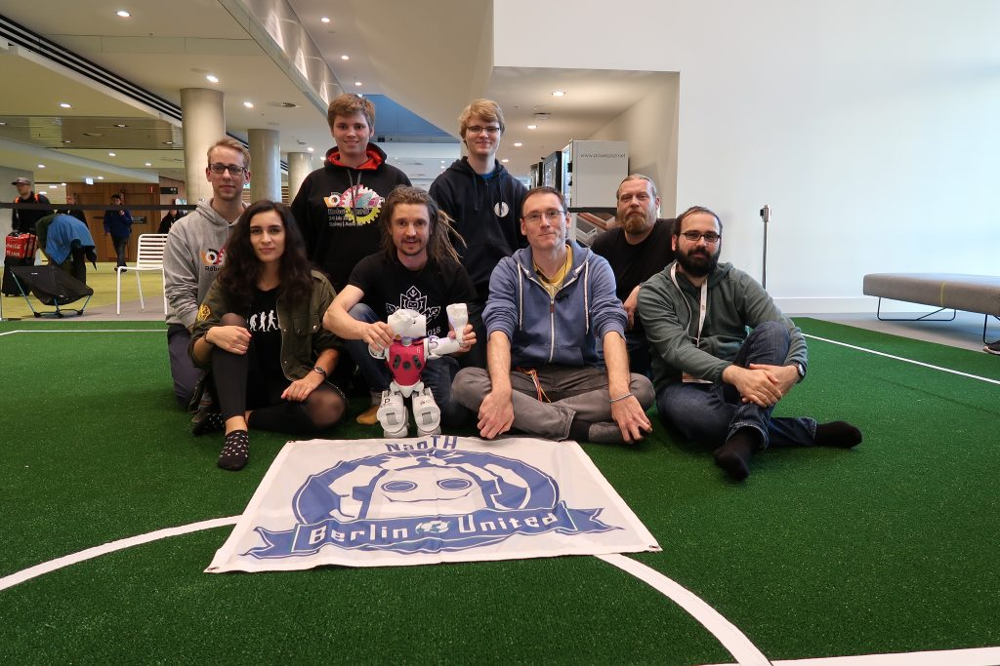

# Welcome to Berlin United

[Berlin United](https://berlin-united.org/) is a robot soccer team in the [RoboCup](https://robocup.org/) [Standard Platform League](https://spl.robocup.org/). 
We release most of our code on GitHub. 
This wiki describes how to set up our code and how our architecture and algorithms work.

This documentation is very much a work in progress and help is appreciated.