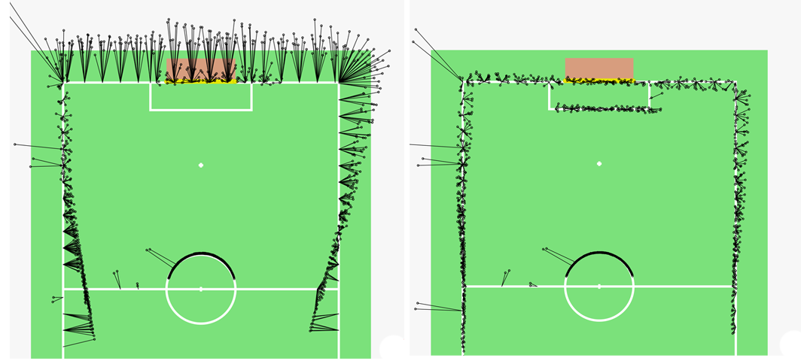
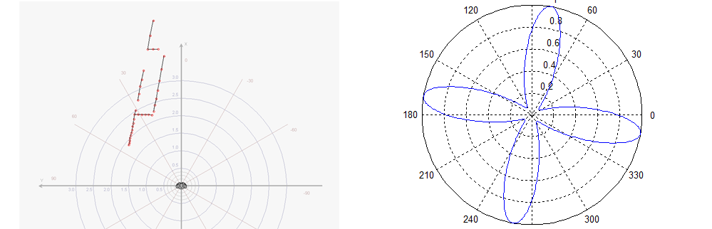
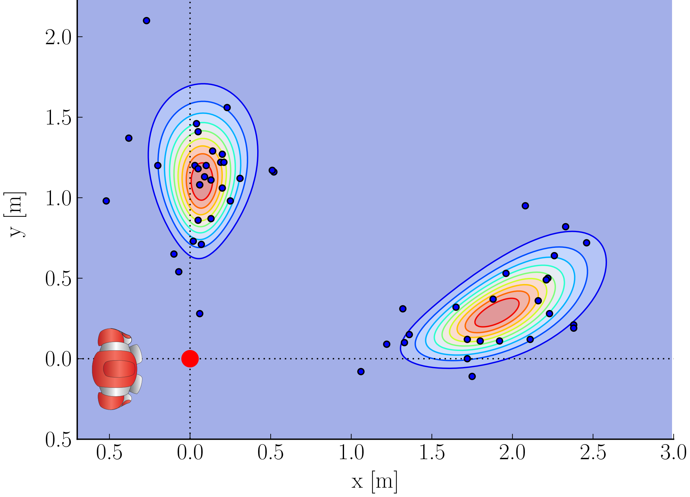
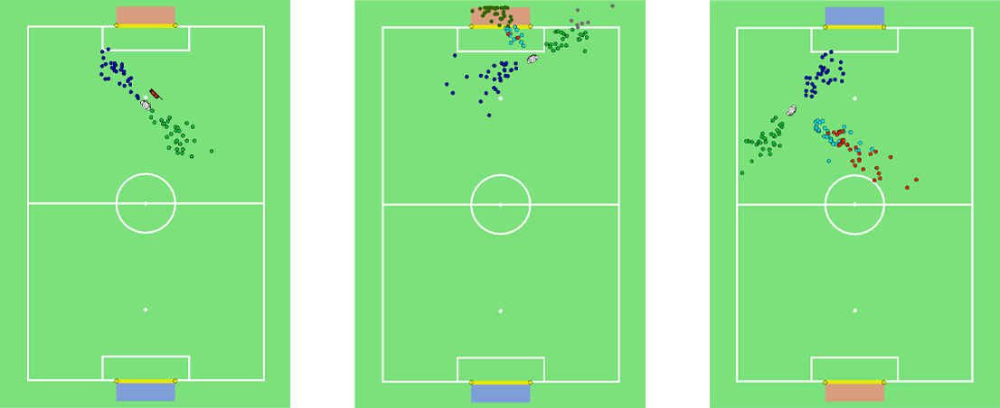
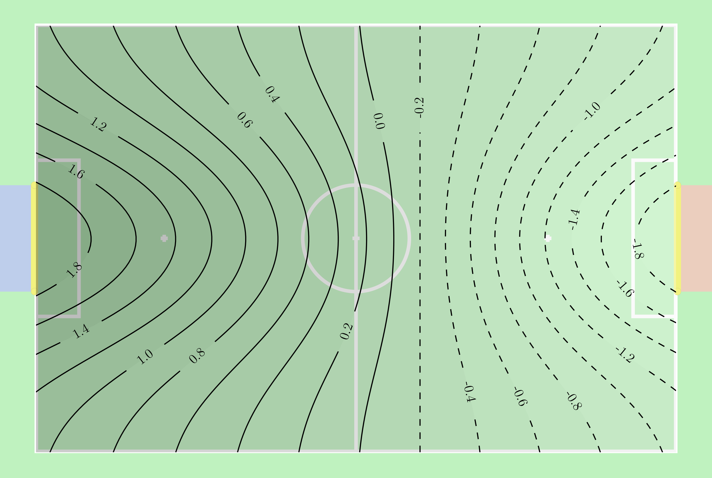

# Modeling
In order to realize a complex and successful cooperative behavior it is necessary to have 
a appropriate model of the surrounding world. In our approach we focus on local models of particular aspect

## Camera Matrix Calibration
Camera matrix is the coordinate transformation of a camera in relation to the local coordinate 
system of the robot. The camera matrix is used to establish the relation between objects detected 
in the image and their position relative to the robot. For instance, the center of the detected 
ball in the image can be projected on the ground plane and so  the distance to the actual ball 
can be estimated. In a certain way, the camera matrix stands between the basic perception and 
the model of the situation affecting directly the quality of self localization, ball model and 
such. Thus, an accurate estimation of the camera matrix is crucial for the robot's perception 
of its environment. 

One way to estimate the camera matrix is the usage of the kinematic chain in combination with 
the accelerometer and gyrometer to estimate the rotation. This approach, however, can yield 
substantial errors, as the parameters of the kinematic chain differ between the robots due 
to differences in manufacturing and the effect of wearing out over time. In particular the 
following 11 joints have been observed developing major offsets: (body rotation pitch/roll, 
head rotation pitch/roll/yaw, top/bottom camera rotation pitch/roll/yaw). 

In order to compensate for these errors we apply calibration offsets to these joints.
To calculate the offsets we utilize the line percepts, which are provided by the LineGraphProvider described in section LineGraphProider.
The basic approach is to place the robot at a known position on the field and allow it to collect a set of line perceptions by looking around.
Detected line perceptions in the image are projected on the ground plane using the camera matrix.
The projected results are compared with the actual lines on the field.
The resulting error can be minimized by adjusting the aforementioned offsets.
It can be choosen between a simple Gauss-Newton and two Levenberg-Marquardt implementations as minimization algorithm.
The current implementation supports a manual and automatic mode for the calibration procedure.
The figure below illustrates the projection of the collected line perceptions before (left) and after (right) the minimization procedure.

<figure>
  
  <figcaption>
Projection of the line point perceptions before (left) and
after(right) camera calibration. The assignments of the perceived line
points to the field lines, which are used to calculate the error, are
illustrated as black thin
lines.
</figcaption>
</figure>

## Probabilistic Compass
We estimate the orientation of the robot on the field based on the detected line edgels utilizing the fact, that 
all field lines are either orthogonal or parallel to the field. Based on the orientations of the particular 
projected edgels it is possible to estimate the rotation of the robot up to the $\pi$ symmetry.

We calculate the kernel histogram
over the orientations of the particular projected edgels, i.e., edgels
in the local coordinates of the robot. To utilize the symmetry of the
lines we use $\sin$ as distance measure. Let $(x_i)_{i=1}^n$ be the set
of edgel orientations. We calculate the likelihood $S(x)$ for the robot
rotation $x\in[-\pi,\pi)$ as shown in the equation below.

$$
\begin{aligned}
S(x) = \sum_{i=1}^n\exp\left\{ -\frac{\sin^2(2\cdot(x-x_i))}{\sigma^2} \right\}
\end{aligned}
$$

This compass is calculated in each frame where enough edgels have been
detected. It has shown to be robust regarding outliers, e. g., when some
edgels are detected in a robot. It can be directly used to update the
likelihood of particles in the selflocator.
Figure [5.4](#fig:compass){reference-type="ref" reference="fig:compass"}
shows a set of edgels detected in a particular frame on the left side.
On the right side the according histogram is plotted.

Left figure visualizes the edgel graph in local coordinates of the
robot in a particular frame. Right illustrates the kernel histogram over
the orientations of edgels shown left, calculated with above
formula.

## Multi-Hypothesis-Extended-Kalman-Filter Ball Model
Although there is usually only one ball involved in a RoboCup game, there are several good reasons 
for being able to represent and track several ball hypotheses at the same time. The main reason however 
are the false-positives. Due to the change to the new black and white ball as described in the 
Section~\ref{s:ball_detection}, the chance of a false positive became much higher. The most of the 
false detections appear only sporadically and do not persist over long time. Tracking several possible 
balls at the same time allows  to effectively separate the true (persistent) detections from the false (sporadic) ones.

Each candidate (hypothesis) is tracked by an Extended Kalman filter. The Extended Kalman filter is used with 
linear state transition model and a nonlinear observation model. The state is defined as the location and 
velocity of the ball in the robot's local Cartesian coordinates while the measurement is taken as the 
vertical and horizontal angle in the camera image.

At first all hypotheses (ball candidates) are removed and not considered in the following steps which 
weren't updated for an amount of time and theirs variance in location became too high. Then the 
odometry of the robot since the last update is applied transparently to the states and covariances of
the Extended Kalman filters so they stay in the robot's local coordinate system. Next, the current 
position and velocity of the ball candidates are calculated according to the linear state transition 
model. The friction between ball and carpet is modeled as negative acceleration in opposite direction 
to the current velocity and incorporated into the linear state transition model as a control vector. 
After that the ball candidates in the image are assigned to the hypotheses and the update is performed.
Each measurement is assigned at most to one hypothesis and vice versa. If no matching hypothesis is 
found a new Kalman filter is created which will represent a new hypothesis. The final ball model for 
the behavior is the hypothesis which is the closest to the robot and is updated frequently.

## Multi-Hypothesis Goal Model (MHGM)
In this section we describe a multi-hypothesis approach for modeling a soccer goal within the RoboCup context.

The whole goal is rarely observed and we assume the image processing to detect separate goal posts. So we represent the goal by its corresponding posts. To reduce complexity of the shape of uncertainty we model the separate goal posts in local robot coordinates. The ambiguous goal posts are tracked by a multi-hypothesis particle filter. The actual goal model is extracted from the set of post hypotheses. 

The joint uncertainty can be subdivided into *noise*, *false detections* and *ambiguity*. Each of these components is treated separately in our approach.

The multi-hypothesis filter has to take care of noise and false detections, but it does not resolve the ambiguity of the goal posts. Instead, all occurring goal posts are represented by corresponding hypotheses and the ambiguity is solved on the next level when the goal model is extracted.

Particle filters are great in filtering noise and are shown to be very effective for object tracking. 

To deal with sparse false positives we introduce a delayed initialization procedure. We assume a false positive to result in an inconsistency, i.e., it cannot be confirmed by any existing goal post hypothesis. In this case the percept is stored in a short time buffer for later consideration. This buffer is checked for clusters, in case a significant cluster of goal post percepts accumulated during a short period of time, a new hypothesis is initialized based on this cluster.

The dense false detections result in post hypotheses, which is later ignored while extracting the goal.

More detailed description of the algorithm as well as the experimental
results can be found in [@HSR-ScheunemannMellmann-14].

## Simulation Based Selection of Actions

The robot is capable of different kicks and should given a particular situation, e.g., the robot's position, the position 
of the ball and obstacles, determine which kick is the optimal kick to perform in this situation. A naive geometric 
solution which selects a kick based on the robot's direction towards the opponent goal does not account for uncertainty of the actual execution of the kick. Furthermore the distance of the kick is not considered in this approach. An improved kick selection algorithm was 
developed which is based on a forward simulation of the actions. Thereby each possible kick is simulated and the 
best kick is chosen based on the outcome, i.e., the position of the ball after the kick. Uncertainty and additional 
constraints can be integrated in a straight forward way.

### Definition of an Action

An Action is a set of parameters which describe a probability
distribution of the possible ball location after the execution of a
kick. Currently there are 4 kicks, two forward kicks and two sidekicks
as well as the case of turning around the ball. The probability
distribution is modeled as a Gaussian distribution. The parameters which
describe the distribution for one action are velocity, angle and their
standard deviations.

Kick action model: distributions of the possible ball positions after
a sidekick and the long kick forward with the right foot. Blue dots
illustrate experimental data.

### Determine the parameters

To calculate the initial velocity of a kick the distance the ball rolled
after a kick was measured in an experiment. By using the stopping
distance formula the initial velocity of one kick can be calculated by

$$\upsilon_0=\sqrt{d\cdot 2c_R\cdot g}\label{eq:velocity}$$ 

where $\upsilon$ is the initial velocity of the ball. $c_R$ the rolling
resistance coefficient and $g$ the gravitational constant. The mean of
$\upsilon_0$ of multiple repetitions defines the initial velocity of
this action. The standard deviation of the repetitions defines the
standard deviation for the velocity of the kick. The parameter for angle
is predefined for every action, e.g., it's zero for forward kicks and 90
degrees for left sidekick. The standard deviation for the angle is the
standard deviation of the angle measurements from the previous
experiment. The coefficient of friction is calibrated to a real surface
from rolled distances of the ball rolling on this surface with a known
initial velocity. For this, we performed multiple experiments with an
inclined plane starting at different heights. From these heights we
could determine the initial potential energy of the ball, which was
converted to kinetic energy by rolling down the inclined plane. At the
end of the inclined plane (not taking into account the friction of the
inclined plane), the initial velocity of the ball could thus be
determined. We then measured the distance in multiple experiments. By
transposing the rolling distance formula the rolling resistance
coefficient can be calculated.

$$c_R=\frac{1}{2}\cdot\frac{\upsilon_0^2}{g\cdot d}$$ 

where $\upsilon_0$ is the starting velocity, $g$ the gravitational constant, and $d$ the
total distance the ball traveled. The mean of the calculated
coefficients is used as the rolling resistance coefficient for the other
calculations. In the algorithm the position of the ball after the
execution of an action is needed. To calculate this, the formula is
transposed to calculate the distance the ball rolls after the execution
of an action: 

$$d=\frac{\upsilon_0^2}{2c_R\cdot g}\label{eq:distance}$$

where $\upsilon$ is the initial velocity of the ball. $c_R$ the rolling
resistance coefficient and $g$ the gravitational constant.
The above figure shows a resulting end position cloud of
a hypothetical kick. The end points are calculated by drawing a sample
from both the angle and kick speed distribution and plugging these
values in the last equation. For details, refer to the next section.

### The algorithm
The whole simulation is divided into three steps: simulate the
consequences, evaluate the consequences and decide the best action.

#### Simulating the consequences

Each action is simulated a fixed number of times. The resulting ball
position of one simulation for an action is referred to as particle. The
positions of the particles are calculated according to the parameters of
the action with applied standard deviations. The algorithm checks for possible 
collisions with the goal box and in case there are any the kick distance 
gets shortened appropriately. Collisions with the obstacle model are handled the same way.

#### Evaluation

Each particle is sorted in different categories based on where on the
field it is, e.g., inside the field, inside the own Goal, outside the
field. If a particle lands outside the field it is sorted in the
category according where it went out, e.g., left sideline or opponent
ground line. This is repeated for every particle of every Action that is
defined. The algorithm then counts the number of particles of each
action that is either inside the field or inside the opponent goal.

#### Decision

If an action has less than the defined threshold of particles either
inside the field or inside the opponent goal the action is discarded.
For the remaining actions the one with the most particles inside the
opponent goal is calculated. If there are two actions with the most
particles inside the goal the best action is determined by evaluating
the particles of each actions with the potential field. The action with
the smaller sum is selected. If at least one particle of an action is
inside the own goal the action will not be chosen. If no action has a
particle inside the opponent goal the potential field is used to rank
the actions. In this case all particles from one action are evaluated by
the potential field and the mean of these values is calculated. The
action with the highest mean is selected and executed. If no action has
enough good particles, the best action is to turn towards the opponent
goal.

Three examples of kick simulations. Each possible kick direction is
simulated with 30 samples (different colors correspond to different
kicks). Left: the short and long kicks are shortened due to collision
with an obstacle. Middle: long kick is selected as the best action since
it has the most samples result in a goal. Right: the best action is
sidekick to the right -- the other kicks are more likely to end up in a
dangerous position for the own goal according to the potential
field.

### Potential field

A potential field assigns a value to each position of the ball inside
the field. The values reflect the static strategy of the game and are
used to compare possible ball positions in terms of their strategic
value. For instance, the position a meter away in front of the opponent
goal is obviously much better than the one in front of the own goal. In
our experiments we use the following potential field:

$$
\begin{aligned}
P(x) = \underbrace{x^T\cdot\nu_\text{opp}}_{\text{linear slope}} - \underbrace{N(x | \mu_\text{opp}, \Sigma_{\text{opp}})}_{\text{opponent goal attractor}} + \underbrace{N(x | \mu_\text{own}, \Sigma_{\text{own}})}_{\text{own goal repulsor}},
\end{aligned}
$$

where $N(\cdot | \mu, \Sigma)$ is the normal distribution with mean
$\mu$ and covariance $\Sigma$. It consists of three different parts: the
linear slope points from the own goal towards the opponent goal and is
modeling the general direction of attack; the exponential repulsor
$N(x | \mu_\text{own}, \Sigma_{\text{own}})$ prevents kicks towards the
center in front of own goal; and
$N(x | \mu_\text{opp}, \Sigma_{\text{opp}})$ creates an exponential
attractor towards the opponent goal. The configuration used in our
experiments is $$\nu_\text{opp} = \left(-1/x_{\text{opp}}, 0\right)^T$$
with $x_{\text{opp}} = 4.5$ being the $x$-position of the opponent goal
and

$$\begin{aligned}
\mu_{\text{own}} &= (-4.5, 0) & \mu_{\text{opp}} &= (4.5, 0) \\
\Sigma_{\text{own}} &= \left(\begin{array}{cc}3.375^2 & 0 \\ 0 & 1.2^2\end{array}\right) &
\Sigma_{\text{opp}} &= \left(\begin{array}{cc}2.25^2 & 0 \\ 0 & 1.2^2\end{array}\right)
\end{aligned}
$$

for the repulsor and attractor respectively. All parameters are of unit
m. The resulting potential field is visualized below.

<figure>
  
  <figcaption>
Strategic potential field evaluating ball positions. Own goal is on
the left (blue).
</figcaption>
</figure>

A more detailed description of this simulation can be found in
@RCMellmannSchlotterBlum16. A continuation of this work was
presented at the HUMANOIDS 2017 RoboCup Workshop
@HSR-MellmannSchlotter-17.

## Arm Collision Detection

In the current implementation of the stand and walk motions the arms are
used for stability and energy efficiency. During the stand motion the
arms are kept down along the sides to minimize energy consumption, and
are moved back and forth during the walk to balance the rotational
forces and stabilize the walk. On the downside, these arm poses
effectively enlarge the frontal silhouette significantly increasing the
chance of collision with other players or goal posts, which may
destabilize the robot and lead to a fall or a penalty for illegal
pushing.

The goal of collision detection is to recognize when robots arms collide
with an external object. When a collision is detected, the robot reacts
with an evasive movement by taking the arms back and so effectively
minimizing its silhouette. This allows the robot to "sneak" through
narrow spaces without falling or pushing others. The earlier a collision
is recognized, the more effective will be the avoidance. However, a
false detection will force the robot to take the arms back unnecessarily
destabilizing it.

A collision with an arm can be identified by observing the difference in
the planned joint position (MotorJointdata) and the measured joint
position (SensorJointData) of the LShoulderPitch and RShoulderPitch
joints. These joints have the largest leverage and are affected the most
when a collision on an arm occurs.

{#fig:error-function
width="\\textwidth"}

In the current implementation we use a straight forward approach. A
collision is detected when the moving average of the absolute error in
the joint position rises above a fixed threshold. The moving average is
calculated over a fixed window of 100 frames, i.e., 1 second. Note that
there is a delay of 4 frames, i.e., 40 ms, between the joint position
command and the corresponding measurement. This delay needs to be taken
into account when calculating the error in the joint position. To
determine the threshold a number of experiments with collisions was
recorded. The threshold was calculated as a maximum of the moving
average error over all experiments, with a bit of tolerance. Together
with the delay induced by the moving average filter, this results in a
conservative detector.

shows the accumulated absolute error for both arms. During the
experiment the robot goes from stand to walk and a collision occurs at
the left arm. It can be clearly seen that the error for the left arm
rises above the threshold (red line) when the collision occurs, while
the error for the right arm (the arm without collision) stays well below
the threshold during the entire time.

Despite its simplicity, this approach has shown good results during the
RoboCup competition in 2017 and was able to recognize most of the
collisions. In the current work we focus on a more sensitive and
accurate detector. To avoid false detections, the static threshold has
to be chosen larger than the largest expected error which might occur
with out a collision. The accuracy can be improved with a dynamic
threshold. We observed a correlation between the position of the joint
the average absolute error which. Thus, a threshold depending on the
position of the joint might improve the results significantly.

## Time synchronization

The robots communicate via wifi with the gamecontroller and with each
other. The communicated information are not only used for debugging &
visualization in RobotControl, their're also used in the behavior and
role decision of each player. Because of the different wifi conditions
in the lab, during competitions and other events, the robots couldn't be
very confident how reliable the provided information are. So far the
robots couldn't determine, when the data was sent and therefore how old
the received data really is. For this reason it was necessary to
implement a synchronization primitive in order to account for the
transmission latency, which could be as fast as  20ms, but also could
took up to 1s. The idea of the time synchronization module is based on
the "simple network time protocol", which is a simplified version of
NTP. In contrast to the standard SNTP, we're using extra data fields in
our teamcomm message, instead of a low level network format. Further we
doesn't use a server, centralized software instance, instead the robots
themselves deciding to which other robot they want to synchronize with
and sending them the appropriate information. That results in a
decentralized simple network time protocol. The whole process is based
on timestamps in ms and works as follow:

-   a robot randomly selects a teammate he wants to synchronize with

-   he creates a ntp request which contains the player number of the
    synchronizing partner, the timestamp of the last message the partner
    send and the timestamp the robot received the last message.

-   after some time, the robot should get a similar request from its
    teammate and can calculate with the given information the total
    round-trip-time (RTT) and the latency for one direction

-   the fastest transmission cycle is then used to calculate the time
    offset between the robot and its teammate

-   the offset can then be used to provide an estimated time of the
    teammates for other modules

Together with the estimated time of the teammates and the timestamped
message data, each robot is able to determine how "old" the received
data of its teammates are. This synchronization primitive is not as
accurate as the standard NTP, but it is reasonably good and much better
than a manually chosen latency or no synchronization at all. Currently
only the teamball module uses the time synchronization to determine how
old a seen ball of its teammates really is, but future development
should use the feature more and thus make the communicated information
more reliable and the thereon based calculations more accurate.

## IMU

A Unscented-Kalman-Filter is used to combine the measurements of the
accelerometer and gyrometer to a orientation and a gravity adjusted
acceleration in the inertial frame. Quaternions are used in calculations
and the orientation is represented as a rotation vector (Euler vector)
in the state of the Unscented-Kalman-Filter to improve the numerical
stability and avoid the problem of singularities.
