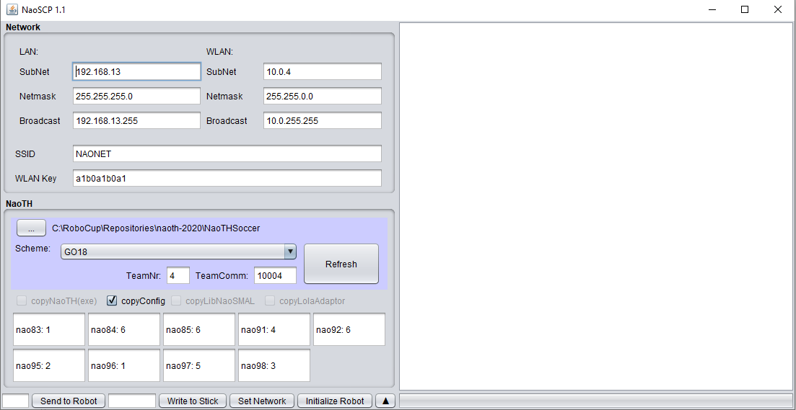

# NaoSCP
NaoSCP is a tool created by us which helps to deploy our code to the NAO. We provide it as a netbeans project inside
our NaoTH repository. The netbeans project is located at `<NaoTH-Projekt/Naoth-2020>/NaoSCP`. Inside netbeans you can
open it with: File->Import Project `<ProjectDir>`/NaoSCP  

If you don't like netbeans or can't use it you can also compile and run it directly with gradle:
```bash 
./gradlew.bat clean build
```
To run it manually you can execute ONE of the following commands:

``` sh title="Run NaoSCP"
./gradlew.bat run
./dist/naoscp.bat
java -jar dist/lib/NaoSCP-1.1.jar
```
You should see something like this  


- TODO add nao scp docu in extra site here and remove it from teamreport
- TODO: add note about alias in bashrc for gradle run/build naoscp

## Initialize Robot
This will prompt you for the extern/lib directory. This could be for example 
`/home/myuser/robocup/repositories/linuxtoolchain/toolchain_nao/extern/lib`

After that you are prompted for the current IP address of the robot.

The output of Initialize robot is something like this. Please note that it takes a couple of minutes and the robot will restart
during this process. 
??? "Initialize Robot Output"
    ```
    Set up deploy directory '/tmp/nao_scp_init_5537768996652352122/setup/deploy'
    copy libnaosmal.so
    copy lola_adaptor
    copy naoth
    copy reachability_grid.dat
    copy fy1300.json
    copy IKParameters.cfg
    copy modules.cfg
    copy LineGraphProvider.cfg
    copy CameraInfoTop.cfg
    copy CameraInfoBottom.cfg
    copy FootGroundContactParameters.cfg
    copy Walk_General.cfg
    copy Simulation.cfg
    copy stand_up_from_side.mef
    copy stand_up_from_front.mef
    copy goalie_sit_n_dive_left.mef
    copy goalie_get_fast_down.mef
    copy jump_indicator_left.mef
    copy goalie_sit.mef
    copy jump_indicator_right.mef
    copy goalie_sit_n_dive_right.mef
    copy block_middle.mef
    copy goalie_sit_block.mef
    copy goalie_sit_small.mef
    copy stand_up_from_back.mef
    copy goalie_get_down.mef
    copy stand_up_from_back_arms_back.mef
    copy kick_right.mef
    copy CameraMatrixOffset.cfg
    copy ArmMotionParams.cfg
    copy previewControl.prm
    copy KeyFrameMotionParameters.cfg
    copy player.cfg
    copy IKParameters.cfg
    copy modules.cfg
    copy joints.cfg
    copy PoseBeforeKickOff.cfg
    copy Walk_FootTrajectoryGenerator2018.cfg
    copy Walk_ZMPPlanner2018.cfg
    copy mass.cfg
    copy Walk_TorsoRotationStabilizer.cfg
    copy Walk_FeetStabilizer.cfg
    copy stand_up_from_side.mef
    copy stand_up_from_front.mef
    copy goalie_sit_n_dive_left.mef
    copy goalie_get_fast_down.mef
    copy goalie_sit.mef
    copy goalie_sit_n_dive_right.mef
    copy block_middle.mef
    copy goalie_sit_block.mef
    copy goalie_sit_small.mef
    copy stand_up_from_back.mef
    copy goalie_get_down.mef
    copy goalie_sit_n_dive_left_test.mef
    copy stand_up_from_back_arms_back.mef
    copy kick_right.mef
    copy goalie_sit_n_dive_right_test.mef
    copy Walk_FootStepPlanner2018.cfg
    copy previewControl.prm
    copy Motion.cfg
    copy CNNBallDetector.cfg
    copy modules.cfg
    copy LineGraphProvider.cfg
    copy IntegralFieldDetector.cfg
    copy previewControl.prm
    copy modules.cfg
    copy LineGraphProvider.cfg
    copy TeamBallLocatorCanopyCluster.cfg
    copy previewControl.prm
    copy IKParameters.cfg
    copy modules.cfg
    copy LineGraphProvider.cfg
    copy CameraInfoTop.cfg
    copy CameraInfoBottom.cfg
    copy Simulation.cfg
    copy stand_up_from_side.mef
    copy stand_up_from_front.mef
    copy goalie_sit_n_dive_left.mef
    copy goalie_get_fast_down.mef
    copy jump_indicator_left.mef
    copy goalie_sit.mef
    copy jump_indicator_right.mef
    copy goalie_sit_n_dive_right.mef
    copy block_middle.mef
    copy goalie_sit_block.mef
    copy goalie_sit_small.mef
    copy stand_up_from_back.mef
    copy goalie_get_down.mef
    copy stand_up_from_back_arms_back.mef
    copy kick_right.mef
    copy ArmMotionParams.cfg
    copy previewControl.prm
    copy IKParameters.cfg
    copy modules.cfg
    copy LineGraphProvider.cfg
    copy CameraInfo.cfg
    copy Simulation.cfg
    copy stand_up_from_side.mef
    copy stand_up_from_front.mef
    copy goalie_sit_n_dive_left.mef
    copy goalie_get_fast_down.mef
    copy jump_indicator_left.mef
    copy goalie_sit.mef
    copy jump_indicator_right.mef
    copy goalie_sit_n_dive_right.mef
    copy block_middle.mef
    copy goalie_sit_block.mef
    copy goalie_sit_small.mef
    copy stand_up_from_back.mef
    copy goalie_get_down.mef
    copy stand_up_from_back_arms_back.mef
    copy kick_right.mef
    copy ArmMotionParams.cfg
    copy previewControl.prm
    copy modules.cfg
    copy previewControl.prm
    copy readme.txt
    copy CameraMatrixOffset.cfg
    copy CameraMatrixOffset.cfg
    copy CameraMatrixOffset.cfg
    copy CameraMatrixOffset.cfg
    copy CameraMatrixOffset.cfg
    copy CameraMatrixOffset.cfg
    copy CameraMatrixOffset.cfg
    copy CameraMatrixOffset.cfg
    copy readme.txt
    copy CameraMatrixOffset.cfg
    copy CameraMatrixOffset.cfg
    copy CameraMatrixOffset.cfg
    copy CameraMatrixOffset.cfg
    copy CameraMatrixOffset.cfg
    copy readme.txt
    copy CameraMatrixOffset.cfg
    copy readme.txt
    copy CameraMatrixOffset.cfg
    copy CameraMatrixOffset.cfg
    copy readme.txt
    copy CameraMatrixOffset.cfg
    copy CameraMatrixOffset.cfg
    copy CameraMatrixOffset.cfg
    copy readme.txt
    copy CameraMatrixOffset.cfg
    copy strategy.cfg
    copy reference_points_cd18Left.txt
    copy Roles.cfg
    copy Roles.cfg
    copy Roles.cfg
    copy RoleDecisionAssignmentDistance.cfg
    copy RoleDecisionAssignmentStatic.cfg
    copy RoleDecisionDynamic.cfg
    copy modules.cfg
    copy Roles.cfg
    copy RoleDecisionAssignmentStatic.cfg
    copy RoleDecisionDynamic.cfg
    copy Roles.cfg
    copy Roles.cfg
    copy scheme.cfg
    copy .gitignore
    copy fy1500.json
    copy readme.txt
    copy reference_points_cd18Right.txt
    copy player.cfg
    copy modules.cfg
    copy joints.cfg
    copy CameraSettingsTop.cfg
    copy teamcomm.cfg
    copy team.cfg
    copy MCSLParameters.cfg
    copy mass.cfg
    copy FieldInfo.cfg
    copy CameraSettings.cfg
    copy agent.cfg
    copy CommonCameraSettings.cfg
    copy g2018-04-28_GO_devils_half2_180428-1232-Nao0075_141.dat
    copy g2018-04-28_GO_devils_half1_090917-0436-Nao0377_120.dat
    copy g2018-04-28_GO_devils_half1_180428-1212-Nao0075_128.dat
    copy g2018-04-28_GO_devils_half2_180428-1232-Nao0075_142.dat
    copy g2018-04-28_GO_devils_half2_180428-1232-Nao0075_140.dat
    copy g2018-04-28_GO_devils_half2_090917-0457-Nao0225_137.dat
    copy g2018-04-28_GO_devils_half1_090917-0437-Nao0225_123.dat
    copy g2018-04-28_GO_devils_half2_090917-0457-Nao0377_138.dat
    copy g2018-04-28_GO_devils_half2_090917-0457-Nao0377_139.dat
    copy g2018-04-28_GO_devils_half1_090917-0436-Nao0377_121.dat
    copy g2018-04-28_GO_devils_half1_180428-1212-Nao0075_126.dat
    copy g2018-04-28_GO_devils_half1_180428-1212-Nao0075_127.dat
    copy g2018-04-28_GO_devils_half1_090917-0436-Nao0377_122.dat
    copy g2018-04-28_GO_devils_half1_090917-0437-Nao0225_125.dat
    copy g2018-04-28_GO_devils_half2_180428-1240-Nao0379_145.dat
    copy whistles.lst
    copy g2018-04-28_GO_devils_half2_180428-1240-Nao0379_143.dat
    copy g2018-04-28_GO_devils_half1_180428-1220-Nao0379_131.dat
    copy g2018-04-28_GO_devils_half1_180428-1411-Nao0272_132.dat
    copy g2018-04-28_GO_devils_half2_180428-1240-Nao0379_144.dat
    copy g2018-04-28_GO_devils_half1_180428-1220-Nao0379_130.dat
    copy g2018-04-28_GO_devils_half2_090917-0457-Nao0225_135.dat
    copy g2018-04-28_GO_devils_half1_180428-1411-Nao0272_134.dat
    copy behavior-ic.dat
    copy IKParameters.cfg
    copy Walk_FootTrajectoryGenerator2018.cfg
    copy Walk_LiftingFootCompensator.cfg
    copy Walk_TorsoRotationStabilizer.cfg
    copy Walk_FeetStabilizer.cfg
    copy Simulation.cfg
    copy Walk_HipRotationOffsetModifier.cfg
    copy ScanLineParameters.cfg
    copy MultiKalmanBallLocator.cfg
    copy GameLogger.cfg
    copy IKParameters.cfg
    copy GoalDetectorV2Parameters.cfg
    copy CNNBallDetector.cfg
    copy Walk_FootTrajectoryGenerator2018.cfg
    copy BallDetector2018.cfg
    copy RoleDecisionAssignmentDistance.cfg
    copy Walk_ZMPPlanner2018.cfg
    copy Walk_LiftingFootCompensator.cfg
    copy team.cfg
    copy MCSLParameters.cfg
    copy BodyStateParameters.cfg
    copy Walk_TorsoRotationStabilizer.cfg
    copy CompassProvider.cfg
    copy CleanRoleDecision.cfg
    copy GoalFeatureV2Parameters.cfg
    copy FieldInfo.cfg
    copy Walk_FeetStabilizer.cfg
    copy Simulation.cfg
    copy RansacLineDetector.cfg
    copy FieldColorClassifier.cfg
    copy USParameters.cfg
    copy Walk_FootStepPlanner2018.cfg
    copy Walk_HipRotationOffsetModifier.cfg
    copy CommonCameraSettings.cfg
    copy FieldColorClassifierTop.cfg
    copy PathPlanner2018.cfg
    copy ScanLineParameters.cfg
    copy MultiKalmanBallLocator.cfg
    copy GameLogger.cfg
    copy IKParameters.cfg
    copy GoalDetectorV2Parameters.cfg
    copy CNNBallDetector.cfg
    copy ScanGridEdgelDetector.cfg
    copy WhistleDetectorV2.cfg
    copy Walk_FootTrajectoryGenerator2018.cfg
    copy BallDetector2018.cfg
    copy CameraSettingsTop.cfg
    copy RoleDecisionAssignmentDistance.cfg
    copy Walk_ZMPPlanner2018.cfg
    copy Walk_LiftingFootCompensator.cfg
    copy team.cfg
    copy MCSLParameters.cfg
    copy IntegralFieldDetector.cfg
    copy BodyStateParameters.cfg
    copy Walk_TorsoRotationStabilizer.cfg
    copy CompassProvider.cfg
    copy CleanRoleDecision.cfg
    copy GoalFeatureV2Parameters.cfg
    copy FieldInfo.cfg
    copy Walk_FeetStabilizer.cfg
    copy Simulation.cfg
    copy RansacLineDetector.cfg
    copy CameraSettings.cfg
    copy FieldColorClassifier.cfg
    copy USParameters.cfg
    copy Walk_FootStepPlanner2018.cfg
    copy Walk_HipRotationOffsetModifier.cfg
    copy CommonCameraSettings.cfg
    copy Motion.cfg
    copy FieldColorClassifierTop.cfg
    copy PathPlanner2018.cfg
    copy BallDetector2018.cfg
    copy ScanLineParameters.cfg
    copy MultiKalmanBallLocator.cfg
    copy GameLogger.cfg
    copy IKParameters.cfg
    copy GoalDetectorV2Parameters.cfg
    copy CNNBallDetector.cfg
    copy modules.cfg
    copy Walk_FootTrajectoryGenerator2018.cfg
    copy BallDetector2018.cfg
    copy CameraSettingsTop.cfg
    copy RoleDecisionAssignmentDistance.cfg
    copy Walk_ZMPPlanner2018.cfg
    copy Walk_LiftingFootCompensator.cfg
    copy team.cfg
    copy MCSLParameters.cfg
    copy BodyStateParameters.cfg
    copy Walk_TorsoRotationStabilizer.cfg
    copy CompassProvider.cfg
    copy CleanRoleDecision.cfg
    copy GoalFeatureV2Parameters.cfg
    copy FieldInfo.cfg
    copy Walk_FeetStabilizer.cfg
    copy Simulation.cfg
    copy RansacLineDetector.cfg
    copy CameraSettings.cfg
    copy FieldColorClassifier.cfg
    copy USParameters.cfg
    copy Walk_FootStepPlanner2018.cfg
    copy Walk_HipRotationOffsetModifier.cfg
    copy MultiPassBallDetector.cfg
    copy CommonCameraSettings.cfg
    copy FieldColorClassifierTop.cfg
    copy PathPlanner2018.cfg
    copy ScanLineParameters.cfg
    copy MultiKalmanBallLocator.cfg
    copy GameLogger.cfg
    copy IKParameters.cfg
    copy GoalDetectorV2Parameters.cfg
    copy modules.cfg
    copy BallDetector2018.cfg
    copy PotentialActionParameters.cfg
    copy team.cfg
    copy GoalFeatureV2Parameters.cfg
    copy FieldInfo.cfg
    copy IMUModel.cfg
    copy RansacLineDetector.cfg
    copy BallDetector.cfg
    copy FieldColorClassifier.cfg
    copy agent.cfg
    copy CommonCameraSettings.cfg
    copy ScanLineParameters.cfg
    copy MultiKalmanBallLocator.cfg
    copy GameLogger.cfg
    copy IKParameters.cfg
    copy GoalDetectorV2Parameters.cfg
    copy CNNBallDetector.cfg
    copy WhistleDetectorV2.cfg
    copy Walk_FootTrajectoryGenerator2018.cfg
    copy BallDetector2018.cfg
    copy CameraSettingsTop.cfg
    copy RoleDecisionAssignmentDistance.cfg
    copy Walk_ZMPPlanner2018.cfg
    copy Walk_LiftingFootCompensator.cfg
    copy team.cfg
    copy MCSLParameters.cfg
    copy IntegralFieldDetector.cfg
    copy BodyStateParameters.cfg
    copy Walk_TorsoRotationStabilizer.cfg
    copy CompassProvider.cfg
    copy CleanRoleDecision.cfg
    copy GoalFeatureV2Parameters.cfg
    copy FieldInfo.cfg
    copy Walk_FeetStabilizer.cfg
    copy Simulation.cfg
    copy RansacLineDetector.cfg
    copy CameraSettings.cfg
    copy FieldColorClassifier.cfg
    copy USParameters.cfg
    copy Walk_FootStepPlanner2018.cfg
    copy Walk_HipRotationOffsetModifier.cfg
    copy CommonCameraSettings.cfg
    copy Motion.cfg
    copy FieldColorClassifierTop.cfg
    copy PathPlanner2018.cfg
    copy ScanLineParameters.cfg
    copy MultiKalmanBallLocator.cfg
    copy GameLogger.cfg
    copy IKParameters.cfg
    copy GoalDetectorV2Parameters.cfg
    copy CNNBallDetector.cfg
    copy ScanGridEdgelDetector.cfg
    copy WhistleDetectorV2.cfg
    copy Walk_FootTrajectoryGenerator2018.cfg
    copy CameraSettingsTop.cfg
    copy RoleDecisionAssignmentDistance.cfg
    copy Walk_ZMPPlanner2018.cfg
    copy Walk_LiftingFootCompensator.cfg
    copy team.cfg
    copy MCSLParameters.cfg
    copy IntegralFieldDetector.cfg
    copy BodyStateParameters.cfg
    copy Walk_TorsoRotationStabilizer.cfg
    copy CompassProvider.cfg
    copy CleanRoleDecision.cfg
    copy GoalFeatureV2Parameters.cfg
    copy FieldInfo.cfg
    copy Walk_FeetStabilizer.cfg
    copy Simulation.cfg
    copy RansacLineDetector.cfg
    copy CameraSettings.cfg
    copy FieldColorClassifier.cfg
    copy USParameters.cfg
    copy Walk_FootStepPlanner2018.cfg
    copy Walk_HipRotationOffsetModifier.cfg
    copy CommonCameraSettings.cfg
    copy Motion.cfg
    copy FieldColorClassifierTop.cfg
    copy PathPlanner2018.cfg
    copy GoalFeatureParameters.cfg
    copy ScanLineParameters.cfg
    copy IKParameters.cfg
    copy GoalDetectorV2Parameters.cfg
    copy CameraSettingsTop.cfg
    copy SimpleFieldColorClassifierParameters.cfg
    copy GoalFeatureV2Parameters.cfg
    copy FieldInfo.cfg
    copy CameraSettings.cfg
    copy RedBallDetector.cfg
    copy ScanLineParameters.cfg
    copy MultiKalmanBallLocator.cfg
    copy GameLogger.cfg
    copy IKParameters.cfg
    copy GoalDetectorV2Parameters.cfg
    copy Walk_FootTrajectoryGenerator2018.cfg
    copy BallDetector2018.cfg
    copy Walk_ZMPPlanner2018.cfg
    copy Walk_LiftingFootCompensator.cfg
    copy team.cfg
    copy MCSLParameters.cfg
    copy BodyStateParameters.cfg
    copy Walk_TorsoRotationStabilizer.cfg
    copy CompassProvider.cfg
    copy CleanRoleDecision.cfg
    copy GoalFeatureV2Parameters.cfg
    copy Walk_FeetStabilizer.cfg
    copy Simulation.cfg
    copy RansacLineDetector.cfg
    copy FieldColorClassifier.cfg
    copy USParameters.cfg
    copy Walk_FootStepPlanner2018.cfg
    copy Walk_HipRotationOffsetModifier.cfg
    copy CommonCameraSettings.cfg
    copy FieldColorClassifierTop.cfg
    copy PathPlanner2018.cfg
    copy ScanLineParameters.cfg
    copy MultiKalmanBallLocator.cfg
    copy GameLogger.cfg
    copy IKParameters.cfg
    copy GoalDetectorV2Parameters.cfg
    copy Walk_FootTrajectoryGenerator2018.cfg
    copy BallDetector2018.cfg
    copy CameraSettingsTop.cfg
    copy Walk_ZMPPlanner2018.cfg
    copy Walk_LiftingFootCompensator.cfg
    copy team.cfg
    copy MCSLParameters.cfg
    copy BodyStateParameters.cfg
    copy Walk_TorsoRotationStabilizer.cfg
    copy CompassProvider.cfg
    copy GoalFeatureV2Parameters.cfg
    copy Walk_FeetStabilizer.cfg
    copy Simulation.cfg
    copy RansacLineDetector.cfg
    copy CameraSettings.cfg
    copy FieldColorClassifier.cfg
    copy Walk_FootStepPlanner2018.cfg
    copy Walk_HipRotationOffsetModifier.cfg
    copy CommonCameraSettings.cfg
    copy FieldColorClassifierTop.cfg
    copy PathPlanner2018.cfg
    copy ScanLineParameters.cfg
    copy MultiKalmanBallLocator.cfg
    copy GameLogger.cfg
    copy IKParameters.cfg
    copy GoalDetectorV2Parameters.cfg
    copy CNNBallDetector.cfg
    copy Walk_FootTrajectoryGenerator2018.cfg
    copy BallDetector2018.cfg
    copy CameraSettingsTop.cfg
    copy RoleDecisionAssignmentDistance.cfg
    copy Walk_ZMPPlanner2018.cfg
    copy Walk_LiftingFootCompensator.cfg
    copy team.cfg
    copy MCSLParameters.cfg
    copy BodyStateParameters.cfg
    copy Walk_TorsoRotationStabilizer.cfg
    copy CompassProvider.cfg
    copy CleanRoleDecision.cfg
    copy GoalFeatureV2Parameters.cfg
    copy FieldInfo.cfg
    copy Walk_FeetStabilizer.cfg
    copy Simulation.cfg
    copy RansacLineDetector.cfg
    copy CameraSettings.cfg
    copy FieldColorClassifier.cfg
    copy USParameters.cfg
    copy Walk_FootStepPlanner2018.cfg
    copy Walk_HipRotationOffsetModifier.cfg
    copy CommonCameraSettings.cfg
    copy FieldColorClassifierTop.cfg
    copy PathPlanner2018.cfg
    copy ScanLineParameters.cfg
    copy MultiKalmanBallLocator.cfg
    copy GameLogger.cfg
    copy IKParameters.cfg
    copy GoalDetectorV2Parameters.cfg
    copy CNNBallDetector.cfg
    copy Walk_FootTrajectoryGenerator2018.cfg
    copy BallDetector2018.cfg
    copy CameraSettingsTop.cfg
    copy RoleDecisionAssignmentDistance.cfg
    copy Walk_ZMPPlanner2018.cfg
    copy Walk_LiftingFootCompensator.cfg
    copy team.cfg
    copy MCSLParameters.cfg
    copy BodyStateParameters.cfg
    copy Walk_TorsoRotationStabilizer.cfg
    copy CompassProvider.cfg
    copy CleanRoleDecision.cfg
    copy GoalFeatureV2Parameters.cfg
    copy FieldInfo.cfg
    copy Walk_FeetStabilizer.cfg
    copy Simulation.cfg
    copy RansacLineDetector.cfg
    copy CameraSettings.cfg
    copy FieldColorClassifier.cfg
    copy USParameters.cfg
    copy Walk_FootStepPlanner2018.cfg
    copy Walk_HipRotationOffsetModifier.cfg
    copy CommonCameraSettings.cfg
    copy FieldColorClassifierTop.cfg
    copy PathPlanner2018.cfg
    copy ScanLineParameters.cfg
    copy GameLogger.cfg
    copy IKParameters.cfg
    copy GoalDetectorV2Parameters.cfg
    copy LineGraphProvider.cfg
    copy Walk_FootTrajectoryGenerator2018.cfg
    copy BallDetector2018.cfg
    copy CameraSettingsTop.cfg
    copy Walk_ZMPPlanner2018.cfg
    copy Walk_LiftingFootCompensator.cfg
    copy team.cfg
    copy MCSLParameters.cfg
    copy BodyStateParameters.cfg
    copy Walk_TorsoRotationStabilizer.cfg
    copy CompassProvider.cfg
    copy GoalFeatureV2Parameters.cfg
    copy Walk_FeetStabilizer.cfg
    copy Simulation.cfg
    copy RansacLineDetector.cfg
    copy CameraSettings.cfg
    copy FieldColorClassifier.cfg
    copy Walk_FootStepPlanner2018.cfg
    copy Walk_HipRotationOffsetModifier.cfg
    copy CommonCameraSettings.cfg
    copy ScanLineParameters.cfg
    copy MultiKalmanBallLocator.cfg
    copy GameLogger.cfg
    copy IKParameters.cfg
    copy GoalDetectorV2Parameters.cfg
    copy CNNBallDetector.cfg
    copy modules.cfg
    copy ScanGridEdgelDetector.cfg
    copy Walk_FootTrajectoryGenerator2018.cfg
    copy BallDetector2018.cfg
    copy CameraSettingsTop.cfg
    copy RoleDecisionAssignmentDistance.cfg
    copy Walk_ZMPPlanner2018.cfg
    copy Walk_LiftingFootCompensator.cfg
    copy team.cfg
    copy MCSLParameters.cfg
    copy BodyStateParameters.cfg
    copy Walk_TorsoRotationStabilizer.cfg
    copy CompassProvider.cfg
    copy CleanRoleDecision.cfg
    copy GoalFeatureV2Parameters.cfg
    copy FieldInfo.cfg
    copy Walk_FeetStabilizer.cfg
    copy Simulation.cfg
    copy RansacLineDetector.cfg
    copy CameraSettings.cfg
    copy FieldColorClassifier.cfg
    copy USParameters.cfg
    copy Walk_FootStepPlanner2018.cfg
    copy Walk_HipRotationOffsetModifier.cfg
    copy MultiPassBallDetector.cfg
    copy CommonCameraSettings.cfg
    copy FieldColorClassifierTop.cfg
    copy PathPlanner2018.cfg
    copy ScanLineParameters.cfg
    copy MultiKalmanBallLocator.cfg
    copy GameLogger.cfg
    copy IKParameters.cfg
    copy GoalDetectorV2Parameters.cfg
    copy CNNBallDetector.cfg
    copy Walk_FootTrajectoryGenerator2018.cfg
    copy BallDetector2018.cfg
    copy CameraSettingsTop.cfg
    copy RoleDecisionAssignmentDistance.cfg
    copy Walk_ZMPPlanner2018.cfg
    copy Walk_LiftingFootCompensator.cfg
    copy team.cfg
    copy MCSLParameters.cfg
    copy BodyStateParameters.cfg
    copy Walk_TorsoRotationStabilizer.cfg
    copy CompassProvider.cfg
    copy CleanRoleDecision.cfg
    copy GoalFeatureV2Parameters.cfg
    copy FieldInfo.cfg
    copy Walk_FeetStabilizer.cfg
    copy Simulation.cfg
    copy RansacLineDetector.cfg
    copy CameraSettings.cfg
    copy FieldColorClassifier.cfg
    copy USParameters.cfg
    copy Walk_FootStepPlanner2018.cfg
    copy Walk_HipRotationOffsetModifier.cfg
    copy CommonCameraSettings.cfg
    copy FieldColorClassifierTop.cfg
    copy PathPlanner2018.cfg
    copy ScanLineParameters.cfg
    copy GameLogger.cfg
    copy IKParameters.cfg
    copy GoalDetectorV2Parameters.cfg
    copy Walk_FootTrajectoryGenerator2018.cfg
    copy BallDetector2018.cfg
    copy CameraSettingsTop.cfg
    copy Walk_ZMPPlanner2018.cfg
    copy Walk_LiftingFootCompensator.cfg
    copy team.cfg
    copy MCSLParameters.cfg
    copy BodyStateParameters.cfg
    copy Walk_TorsoRotationStabilizer.cfg
    copy CompassProvider.cfg
    copy GoalFeatureV2Parameters.cfg
    copy Walk_FeetStabilizer.cfg
    copy Simulation.cfg
    copy RansacLineDetector.cfg
    copy CameraSettings.cfg
    copy FieldColorClassifier.cfg
    copy Walk_FootStepPlanner2018.cfg
    copy Walk_HipRotationOffsetModifier.cfg
    copy CommonCameraSettings.cfg
    copy ScanLineParameters.cfg
    copy MultiKalmanBallLocator.cfg
    copy GameLogger.cfg
    copy IKParameters.cfg
    copy GoalDetectorV2Parameters.cfg
    copy Walk_FootTrajectoryGenerator2018.cfg
    copy BallDetector2018.cfg
    copy CameraSettingsTop.cfg
    copy RoleDecisionAssignmentDistance.cfg
    copy Walk_ZMPPlanner2018.cfg
    copy Walk_LiftingFootCompensator.cfg
    copy team.cfg
    copy MCSLParameters.cfg
    copy Walk_TorsoRotationStabilizer.cfg
    copy CompassProvider.cfg
    copy CleanRoleDecision.cfg
    copy GoalFeatureV2Parameters.cfg
    copy FieldInfo.cfg
    copy Walk_FeetStabilizer.cfg
    copy Simulation.cfg
    copy RansacLineDetector.cfg
    copy CameraSettings.cfg
    copy FieldColorClassifier.cfg
    copy USParameters.cfg
    copy Walk_FootStepPlanner2018.cfg
    copy Walk_HipRotationOffsetModifier.cfg
    copy CommonCameraSettings.cfg
    copy Motion.cfg
    copy FieldColorClassifierTop.cfg
    copy PathPlanner2018.cfg
    copy ScanLineParameters.cfg
    copy MultiKalmanBallLocator.cfg
    copy GameLogger.cfg
    copy IKParameters.cfg
    copy GoalDetectorV2Parameters.cfg
    copy CNNBallDetector.cfg
    copy modules.cfg
    copy Walk_FootTrajectoryGenerator2018.cfg
    copy BallDetector2018.cfg
    copy CameraSettingsTop.cfg
    copy RoleDecisionAssignmentDistance.cfg
    copy Walk_ZMPPlanner2018.cfg
    copy Walk_LiftingFootCompensator.cfg
    copy team.cfg
    copy MCSLParameters.cfg
    copy BodyStateParameters.cfg
    copy Walk_TorsoRotationStabilizer.cfg
    copy CompassProvider.cfg
    copy CleanRoleDecision.cfg
    copy GoalFeatureV2Parameters.cfg
    copy FieldInfo.cfg
    copy Walk_FeetStabilizer.cfg
    copy Simulation.cfg
    copy RansacLineDetector.cfg
    copy CameraSettings.cfg
    copy FieldColorClassifier.cfg
    copy USParameters.cfg
    copy Walk_FootStepPlanner2018.cfg
    copy Walk_HipRotationOffsetModifier.cfg
    copy MultiPassBallDetector.cfg
    copy CommonCameraSettings.cfg
    copy FieldColorClassifierTop.cfg
    copy PathPlanner2018.cfg
    copy startBrainwashing.sh
    copy robots.cfg
    copy collect_logs
    copy mount_logstick
    copy lola_adaptor
    copy brainwash
    copy naoth
    copy robocup.conf
    copy lola.service
    copy naoth.service
    copy pulseaudio.service
    copy lola_adaptor.service
    copy naoth
    copy default-multi-user.pa
    copy client-multi-user.conf
    copy logstick.rules
    copy brainwashing.rules
    copy net.wlan0.service
    copy net.eth0.service
    copy brainwash
    copy naoth
    copy autoload.ini
    copy checkclock.sh
    copy fstab
    copy syslog.conf
    copy autoload.ini
    copy sshd_config
    copy ld.so.conf
    copy disable-wifi-power-save.rules
    copy brainwashing.rules
    copy cognition-common
    copy checkpart-dummy
    copy naoth
    copy rc.conf
    copy checkRC.sh
    copy mt9m114.ko
    copy empty.txt
    copy .profile
    copy calibrating.wav
    copy 5.wav
    copy usb_stop.wav
    copy nicknacknuck.wav
    copy none.wav
    copy error_usb_wrong_filesystem.wav
    copy error_missing_usb_brainwasher_script.wav
    copy wifi_disabled.wav
    copy battery_low.wav
    copy anDieArbeit.wav
    copy victory.wav
    copy 1.wav
    copy error_while_collecting_logs.wav
    copy 6.wav
    copy error_usb_unknown_mount_error.wav.wav
    copy bip_power_on.wav
    copy collectingdata.wav
    copy 2.wav
    copy 8.wav
    copy bip_power_off.wav
    copy crashed.wav
    copy 7.wav
    copy 4.wav
    copy 3.wav
    copy error_unmounting_usb_drive.wav
    copy play.wav
    copy modified_autoload_ini.wav
    copy wifi_enabled.wav
    copy 0.wav
    copy usb_start.wav
    copy naoth_stop.wav
    copy 9.wav
    copy weeeee.wav
    copy finished.wav
    copy cognition_start.wav
    copy penalized.wav
    copy asta_la_vista.wav
    copy finished_collecting_logs.wav
    copy empty.txt
    copy brainwash_v3v4v5.sh
    copy brainwash_v6.sh
    copy .gitattributes
    copy startBrainwashing.sh
    copy libgdbm.so
    copy libz.a
    copy libjpeg.so
    copy libturbojpeg.a
    copy opencv.pc
    copy gmodule-no-export-2.0.pc
    copy gthread-2.0.pc
    copy protobuf-lite.pc
    copy glib-2.0.pc
    copy libjpeg.pc
    copy protobuf.pc
    copy gobject-2.0.pc
    copy gmodule-export-2.0.pc
    copy libturbojpeg.pc
    copy gio-unix-2.0.pc
    copy gio-2.0.pc
    copy gmodule-2.0.pc
    copy libflite_cmu_indic_lex.a
    copy libsfsexp.a
    copy libvorbisenc.so
    copy libgthread-2.0.so
    copy glibconfig.h
    copy libz.so
    copy libpulse.so
    copy libpulsecommon-3.99.so
    copy libasound.so
    copy libflite_cmu_us_kal.a
    copy libdbus-1.so
    copy libflite_cmulex.a
    copy libstdc++.so
    copy libflite_cmu_grapheme_lang.a
    copy libgobject-2.0.so
    copy libopencv_core.so
    copy libasyncns.so
    copy libFLAC.so
    copy libpulse-simple.so
    copy libprotobuf.so
    copy libgthread-2.0.la
    copy libcap.so
    copy libflite_cmu_us_kal16.a
    copy libflite_cmu_indic_lang.a
    copy libflite_cmu_us_rms.a
    copy libflite_cmu_us_awb.a
    copy libflite_cmu_us_slt.a
    copy libglib-2.0.so
    copy libflite.a
    copy libflite_usenglish.a
    copy libflite_cmu_time_awb.a
    copy libopencv_imgproc.so
    copy libogg.so
    copy libopencv_ml.so
    copy libgio-2.0.la
    copy libturbojpeg.so
    copy libgio-2.0.so
    copy libsndfile.so
    copy liblua53.a
    copy libjpeg.a
    copy libflite_cmu_grapheme_lex.a
    copy libvorbis.so
    copy libattr.so
    copy libopencv_objdetect.so
    copy libgobject-2.0.la
    copy libgmodule-2.0.so
    copy libfftw3.so
    copy libfftw3f.so
    copy libwrap.so
    copy libglib-2.0.la
    copy libjson.so
    copy libgmodule-2.0.la
    copy flite_cmu_us_slt
    copy flite
    ZIP files to /tmp/nao_scp_init_5537768996652352122/setup.zip
    connecting to nao@10.0.4.122
    Permanently added '10.0.4.122' (RSA) to the list of known hosts.
    put /home/nao/tmp/setup.zip
    su
    nao [0] ~ $ su
    Password: 
    root@nao [0] nao # cd /home/nao/tmp/
    root@nao [0] tmp # sudo -u nao unzip -q setup.zip; cd ./setup; bash ./startBrain washing.sh
    ++ date +%y%m%d-%H%M
    + export BACKUP_DIRECTORY=/home/nao/backup_090917-0005
    + BACKUP_DIRECTORY=/home/nao/backup_090917-0005
    ++ pwd
    + export DEPLOY_DIRECTORY=/home/nao/tmp/setup/deploy
    + DEPLOY_DIRECTORY=/home/nao/tmp/setup/deploy
    + export NETWORK_WLAN_SSID=NAONET
    + NETWORK_WLAN_SSID=NAONET
    + export NETWORK_WLAN_PW=a1b0a1b0a1
    + NETWORK_WLAN_PW=a1b0a1b0a1
    + export NETWORK_WLAN_IP=10.0.4
    + NETWORK_WLAN_IP=10.0.4
    + export NETWORK_WLAN_MASK=255.255.0.0
    + NETWORK_WLAN_MASK=255.255.0.0
    + export NETWORK_WLAN_BROADCAST=10.0.255.255
    + NETWORK_WLAN_BROADCAST=10.0.255.255
    + export NETWORK_ETH_IP=192.168.13
    + NETWORK_ETH_IP=192.168.13
    + export NETWORK_ETH_MASK=255.255.255.0
    + NETWORK_ETH_MASK=255.255.255.0
    + export NETWORK_ETH_BROADCAST=192.168.13.255
    + NETWORK_ETH_BROADCAST=192.168.13.255
    + '[' -f /opt/aldebaran/bin/lola ']'
    + '[' -f /usr/bin/lola ']'
    + echo 'Nao V5 or older'
    Nao V5 or older
    + chmod +x brainwash_v3v4v5.sh
    + tail -f nohup.out
    + nohup ./brainwash_v3v4v5.sh
    tail: cannot open `nohup.out' for reading: No such file or directory
    nohup: appending output to `nohup.out'
    root@nao [err 1] setup # 
    Broadcast message from root@nao (Thu Sep 17 00:07:36 2009):
    
    The system is going down for reboot NOW!
    ```

## Send to robot
You need to set the head number and select what you want to deploy. 
??? "Send to robot output"
    ```bash
    check 192.168.13.95
    192.168.13.95 not reachable
    check 10.0.4.95
    connecting to nao@10.0.4.95
    Permanently added '10.0.4.95' (RSA) to the list of known hosts.
    Set up deploy directory '/tmp/nao_scp_deploy_12282646039945354470/deploy'
    copy libnaosmal.so
    copy lola_adaptor
    copy naoth
    copy reachability_grid.dat
    copy fy1300.json
    copy IKParameters.cfg
    copy modules.cfg
    copy LineGraphProvider.cfg
    copy CameraInfoTop.cfg
    copy CameraInfoBottom.cfg
    copy FootGroundContactParameters.cfg
    copy Walk_General.cfg
    copy Simulation.cfg
    copy stand_up_from_side.mef
    copy stand_up_from_front.mef
    copy goalie_sit_n_dive_left.mef
    copy goalie_get_fast_down.mef
    copy jump_indicator_left.mef
    copy goalie_sit.mef
    copy jump_indicator_right.mef
    copy goalie_sit_n_dive_right.mef
    copy block_middle.mef
    copy goalie_sit_block.mef
    copy goalie_sit_small.mef
    copy stand_up_from_back.mef
    copy goalie_get_down.mef
    copy stand_up_from_back_arms_back.mef
    copy kick_right.mef
    copy CameraMatrixOffset.cfg
    copy ArmMotionParams.cfg
    copy previewControl.prm
    copy KeyFrameMotionParameters.cfg
    copy player.cfg
    copy IKParameters.cfg
    copy modules.cfg
    copy joints.cfg
    copy PoseBeforeKickOff.cfg
    copy Walk_FootTrajectoryGenerator2018.cfg
    copy Walk_ZMPPlanner2018.cfg
    copy mass.cfg
    copy Walk_TorsoRotationStabilizer.cfg
    copy Walk_FeetStabilizer.cfg
    copy stand_up_from_side.mef
    copy stand_up_from_front.mef
    copy goalie_sit_n_dive_left.mef
    copy goalie_get_fast_down.mef
    copy goalie_sit.mef
    copy goalie_sit_n_dive_right.mef
    copy block_middle.mef
    copy goalie_sit_block.mef
    copy goalie_sit_small.mef
    copy stand_up_from_back.mef
    copy goalie_get_down.mef
    copy goalie_sit_n_dive_left_test.mef
    copy stand_up_from_back_arms_back.mef
    copy kick_right.mef
    copy goalie_sit_n_dive_right_test.mef
    copy Walk_FootStepPlanner2018.cfg
    copy previewControl.prm
    copy Motion.cfg
    copy CNNBallDetector.cfg
    copy modules.cfg
    copy LineGraphProvider.cfg
    copy IntegralFieldDetector.cfg
    copy previewControl.prm
    copy modules.cfg
    copy LineGraphProvider.cfg
    copy TeamBallLocatorCanopyCluster.cfg
    copy previewControl.prm
    copy IKParameters.cfg
    copy modules.cfg
    copy LineGraphProvider.cfg
    copy CameraInfoTop.cfg
    copy CameraInfoBottom.cfg
    copy Simulation.cfg
    copy stand_up_from_side.mef
    copy stand_up_from_front.mef
    copy goalie_sit_n_dive_left.mef
    copy goalie_get_fast_down.mef
    copy jump_indicator_left.mef
    copy goalie_sit.mef
    copy jump_indicator_right.mef
    copy goalie_sit_n_dive_right.mef
    copy block_middle.mef
    copy goalie_sit_block.mef
    copy goalie_sit_small.mef
    copy stand_up_from_back.mef
    copy goalie_get_down.mef
    copy stand_up_from_back_arms_back.mef
    copy kick_right.mef
    copy ArmMotionParams.cfg
    copy previewControl.prm
    copy IKParameters.cfg
    copy modules.cfg
    copy LineGraphProvider.cfg
    copy CameraInfo.cfg
    copy Simulation.cfg
    copy stand_up_from_side.mef
    copy stand_up_from_front.mef
    copy goalie_sit_n_dive_left.mef
    copy goalie_get_fast_down.mef
    copy jump_indicator_left.mef
    copy goalie_sit.mef
    copy jump_indicator_right.mef
    copy goalie_sit_n_dive_right.mef
    copy block_middle.mef
    copy goalie_sit_block.mef
    copy goalie_sit_small.mef
    copy stand_up_from_back.mef
    copy goalie_get_down.mef
    copy stand_up_from_back_arms_back.mef
    copy kick_right.mef
    copy ArmMotionParams.cfg
    copy previewControl.prm
    copy modules.cfg
    copy previewControl.prm
    copy readme.txt
    copy CameraMatrixOffset.cfg
    copy CameraMatrixOffset.cfg
    copy CameraMatrixOffset.cfg
    copy CameraMatrixOffset.cfg
    copy CameraMatrixOffset.cfg
    copy CameraMatrixOffset.cfg
    copy CameraMatrixOffset.cfg
    copy CameraMatrixOffset.cfg
    copy readme.txt
    copy CameraMatrixOffset.cfg
    copy CameraMatrixOffset.cfg
    copy CameraMatrixOffset.cfg
    copy CameraMatrixOffset.cfg
    copy CameraMatrixOffset.cfg
    copy readme.txt
    copy CameraMatrixOffset.cfg
    copy readme.txt
    copy CameraMatrixOffset.cfg
    copy CameraMatrixOffset.cfg
    copy readme.txt
    copy CameraMatrixOffset.cfg
    copy CameraMatrixOffset.cfg
    copy CameraMatrixOffset.cfg
    copy readme.txt
    copy CameraMatrixOffset.cfg
    copy strategy.cfg
    copy reference_points_cd18Left.txt
    copy Roles.cfg
    copy Roles.cfg
    copy Roles.cfg
    copy RoleDecisionAssignmentDistance.cfg
    copy RoleDecisionAssignmentStatic.cfg
    copy RoleDecisionDynamic.cfg
    copy modules.cfg
    copy Roles.cfg
    copy RoleDecisionAssignmentStatic.cfg
    copy RoleDecisionDynamic.cfg
    copy Roles.cfg
    copy Roles.cfg
    copy scheme.cfg
    copy .gitignore
    copy fy1500.json
    copy readme.txt
    copy reference_points_cd18Right.txt
    copy player.cfg
    copy modules.cfg
    copy joints.cfg
    copy CameraSettingsTop.cfg
    copy teamcomm.cfg
    copy team.cfg
    copy MCSLParameters.cfg
    copy mass.cfg
    copy FieldInfo.cfg
    copy CameraSettings.cfg
    copy agent.cfg
    copy CommonCameraSettings.cfg
    copy g2018-04-28_GO_devils_half2_180428-1232-Nao0075_141.dat
    copy g2018-04-28_GO_devils_half1_090917-0436-Nao0377_120.dat
    copy g2018-04-28_GO_devils_half1_180428-1212-Nao0075_128.dat
    copy g2018-04-28_GO_devils_half2_180428-1232-Nao0075_142.dat
    copy g2018-04-28_GO_devils_half2_180428-1232-Nao0075_140.dat
    copy g2018-04-28_GO_devils_half2_090917-0457-Nao0225_137.dat
    copy g2018-04-28_GO_devils_half1_090917-0437-Nao0225_123.dat
    copy g2018-04-28_GO_devils_half2_090917-0457-Nao0377_138.dat
    copy g2018-04-28_GO_devils_half2_090917-0457-Nao0377_139.dat
    copy g2018-04-28_GO_devils_half1_090917-0436-Nao0377_121.dat
    copy g2018-04-28_GO_devils_half1_180428-1212-Nao0075_126.dat
    copy g2018-04-28_GO_devils_half1_180428-1212-Nao0075_127.dat
    copy g2018-04-28_GO_devils_half1_090917-0436-Nao0377_122.dat
    copy g2018-04-28_GO_devils_half1_090917-0437-Nao0225_125.dat
    copy g2018-04-28_GO_devils_half2_180428-1240-Nao0379_145.dat
    copy whistles.lst
    copy g2018-04-28_GO_devils_half2_180428-1240-Nao0379_143.dat
    copy g2018-04-28_GO_devils_half1_180428-1220-Nao0379_131.dat
    copy g2018-04-28_GO_devils_half1_180428-1411-Nao0272_132.dat
    copy g2018-04-28_GO_devils_half2_180428-1240-Nao0379_144.dat
    copy g2018-04-28_GO_devils_half1_180428-1220-Nao0379_130.dat
    copy g2018-04-28_GO_devils_half2_090917-0457-Nao0225_135.dat
    copy g2018-04-28_GO_devils_half1_180428-1411-Nao0272_134.dat
    copy behavior-ic.dat
    copy IKParameters.cfg
    copy Walk_FootTrajectoryGenerator2018.cfg
    copy Walk_LiftingFootCompensator.cfg
    copy Walk_TorsoRotationStabilizer.cfg
    copy Walk_FeetStabilizer.cfg
    copy Simulation.cfg
    copy Walk_HipRotationOffsetModifier.cfg
    copy ScanLineParameters.cfg
    copy MultiKalmanBallLocator.cfg
    copy GameLogger.cfg
    copy IKParameters.cfg
    copy GoalDetectorV2Parameters.cfg
    copy CNNBallDetector.cfg
    copy Walk_FootTrajectoryGenerator2018.cfg
    copy BallDetector2018.cfg
    copy RoleDecisionAssignmentDistance.cfg
    copy Walk_ZMPPlanner2018.cfg
    copy Walk_LiftingFootCompensator.cfg
    copy team.cfg
    copy MCSLParameters.cfg
    copy BodyStateParameters.cfg
    copy Walk_TorsoRotationStabilizer.cfg
    copy CompassProvider.cfg
    copy CleanRoleDecision.cfg
    copy GoalFeatureV2Parameters.cfg
    copy FieldInfo.cfg
    copy Walk_FeetStabilizer.cfg
    copy Simulation.cfg
    copy RansacLineDetector.cfg
    copy FieldColorClassifier.cfg
    copy USParameters.cfg
    copy Walk_FootStepPlanner2018.cfg
    copy Walk_HipRotationOffsetModifier.cfg
    copy CommonCameraSettings.cfg
    copy FieldColorClassifierTop.cfg
    copy PathPlanner2018.cfg
    copy ScanLineParameters.cfg
    copy MultiKalmanBallLocator.cfg
    copy GameLogger.cfg
    copy IKParameters.cfg
    copy GoalDetectorV2Parameters.cfg
    copy CNNBallDetector.cfg
    copy ScanGridEdgelDetector.cfg
    copy WhistleDetectorV2.cfg
    copy Walk_FootTrajectoryGenerator2018.cfg
    copy BallDetector2018.cfg
    copy CameraSettingsTop.cfg
    copy RoleDecisionAssignmentDistance.cfg
    copy Walk_ZMPPlanner2018.cfg
    copy Walk_LiftingFootCompensator.cfg
    copy team.cfg
    copy MCSLParameters.cfg
    copy IntegralFieldDetector.cfg
    copy BodyStateParameters.cfg
    copy Walk_TorsoRotationStabilizer.cfg
    copy CompassProvider.cfg
    copy CleanRoleDecision.cfg
    copy GoalFeatureV2Parameters.cfg
    copy FieldInfo.cfg
    copy Walk_FeetStabilizer.cfg
    copy Simulation.cfg
    copy RansacLineDetector.cfg
    copy CameraSettings.cfg
    copy FieldColorClassifier.cfg
    copy USParameters.cfg
    copy Walk_FootStepPlanner2018.cfg
    copy Walk_HipRotationOffsetModifier.cfg
    copy CommonCameraSettings.cfg
    copy Motion.cfg
    copy FieldColorClassifierTop.cfg
    copy PathPlanner2018.cfg
    copy BallDetector2018.cfg
    copy ScanLineParameters.cfg
    copy MultiKalmanBallLocator.cfg
    copy GameLogger.cfg
    copy IKParameters.cfg
    copy GoalDetectorV2Parameters.cfg
    copy CNNBallDetector.cfg
    copy modules.cfg
    copy Walk_FootTrajectoryGenerator2018.cfg
    copy BallDetector2018.cfg
    copy CameraSettingsTop.cfg
    copy RoleDecisionAssignmentDistance.cfg
    copy Walk_ZMPPlanner2018.cfg
    copy Walk_LiftingFootCompensator.cfg
    copy team.cfg
    copy MCSLParameters.cfg
    copy BodyStateParameters.cfg
    copy Walk_TorsoRotationStabilizer.cfg
    copy CompassProvider.cfg
    copy CleanRoleDecision.cfg
    copy GoalFeatureV2Parameters.cfg
    copy FieldInfo.cfg
    copy Walk_FeetStabilizer.cfg
    copy Simulation.cfg
    copy RansacLineDetector.cfg
    copy CameraSettings.cfg
    copy FieldColorClassifier.cfg
    copy USParameters.cfg
    copy Walk_FootStepPlanner2018.cfg
    copy Walk_HipRotationOffsetModifier.cfg
    copy MultiPassBallDetector.cfg
    copy CommonCameraSettings.cfg
    copy FieldColorClassifierTop.cfg
    copy PathPlanner2018.cfg
    copy ScanLineParameters.cfg
    copy MultiKalmanBallLocator.cfg
    copy GameLogger.cfg
    copy IKParameters.cfg
    copy GoalDetectorV2Parameters.cfg
    copy modules.cfg
    copy BallDetector2018.cfg
    copy PotentialActionParameters.cfg
    copy team.cfg
    copy GoalFeatureV2Parameters.cfg
    copy FieldInfo.cfg
    copy IMUModel.cfg
    copy RansacLineDetector.cfg
    copy BallDetector.cfg
    copy FieldColorClassifier.cfg
    copy agent.cfg
    copy CommonCameraSettings.cfg
    copy ScanLineParameters.cfg
    copy MultiKalmanBallLocator.cfg
    copy GameLogger.cfg
    copy IKParameters.cfg
    copy GoalDetectorV2Parameters.cfg
    copy CNNBallDetector.cfg
    copy WhistleDetectorV2.cfg
    copy Walk_FootTrajectoryGenerator2018.cfg
    copy BallDetector2018.cfg
    copy CameraSettingsTop.cfg
    copy RoleDecisionAssignmentDistance.cfg
    copy Walk_ZMPPlanner2018.cfg
    copy Walk_LiftingFootCompensator.cfg
    copy team.cfg
    copy MCSLParameters.cfg
    copy IntegralFieldDetector.cfg
    copy BodyStateParameters.cfg
    copy Walk_TorsoRotationStabilizer.cfg
    copy CompassProvider.cfg
    copy CleanRoleDecision.cfg
    copy GoalFeatureV2Parameters.cfg
    copy FieldInfo.cfg
    copy Walk_FeetStabilizer.cfg
    copy Simulation.cfg
    copy RansacLineDetector.cfg
    copy CameraSettings.cfg
    copy FieldColorClassifier.cfg
    copy USParameters.cfg
    copy Walk_FootStepPlanner2018.cfg
    copy Walk_HipRotationOffsetModifier.cfg
    copy CommonCameraSettings.cfg
    copy Motion.cfg
    copy FieldColorClassifierTop.cfg
    copy PathPlanner2018.cfg
    copy ScanLineParameters.cfg
    copy MultiKalmanBallLocator.cfg
    copy GameLogger.cfg
    copy IKParameters.cfg
    copy GoalDetectorV2Parameters.cfg
    copy CNNBallDetector.cfg
    copy ScanGridEdgelDetector.cfg
    copy WhistleDetectorV2.cfg
    copy Walk_FootTrajectoryGenerator2018.cfg
    copy CameraSettingsTop.cfg
    copy RoleDecisionAssignmentDistance.cfg
    copy Walk_ZMPPlanner2018.cfg
    copy Walk_LiftingFootCompensator.cfg
    copy team.cfg
    copy MCSLParameters.cfg
    copy IntegralFieldDetector.cfg
    copy BodyStateParameters.cfg
    copy Walk_TorsoRotationStabilizer.cfg
    copy CompassProvider.cfg
    copy CleanRoleDecision.cfg
    copy GoalFeatureV2Parameters.cfg
    copy FieldInfo.cfg
    copy Walk_FeetStabilizer.cfg
    copy Simulation.cfg
    copy RansacLineDetector.cfg
    copy CameraSettings.cfg
    copy FieldColorClassifier.cfg
    copy USParameters.cfg
    copy Walk_FootStepPlanner2018.cfg
    copy Walk_HipRotationOffsetModifier.cfg
    copy CommonCameraSettings.cfg
    copy Motion.cfg
    copy FieldColorClassifierTop.cfg
    copy PathPlanner2018.cfg
    copy GoalFeatureParameters.cfg
    copy ScanLineParameters.cfg
    copy IKParameters.cfg
    copy GoalDetectorV2Parameters.cfg
    copy CameraSettingsTop.cfg
    copy SimpleFieldColorClassifierParameters.cfg
    copy GoalFeatureV2Parameters.cfg
    copy FieldInfo.cfg
    copy CameraSettings.cfg
    copy RedBallDetector.cfg
    copy ScanLineParameters.cfg
    copy MultiKalmanBallLocator.cfg
    copy GameLogger.cfg
    copy IKParameters.cfg
    copy GoalDetectorV2Parameters.cfg
    copy Walk_FootTrajectoryGenerator2018.cfg
    copy BallDetector2018.cfg
    copy Walk_ZMPPlanner2018.cfg
    copy Walk_LiftingFootCompensator.cfg
    copy team.cfg
    copy MCSLParameters.cfg
    copy BodyStateParameters.cfg
    copy Walk_TorsoRotationStabilizer.cfg
    copy CompassProvider.cfg
    copy CleanRoleDecision.cfg
    copy GoalFeatureV2Parameters.cfg
    copy Walk_FeetStabilizer.cfg
    copy Simulation.cfg
    copy RansacLineDetector.cfg
    copy FieldColorClassifier.cfg
    copy USParameters.cfg
    copy Walk_FootStepPlanner2018.cfg
    copy Walk_HipRotationOffsetModifier.cfg
    copy CommonCameraSettings.cfg
    copy FieldColorClassifierTop.cfg
    copy PathPlanner2018.cfg
    copy ScanLineParameters.cfg
    copy MultiKalmanBallLocator.cfg
    copy GameLogger.cfg
    copy IKParameters.cfg
    copy GoalDetectorV2Parameters.cfg
    copy Walk_FootTrajectoryGenerator2018.cfg
    copy BallDetector2018.cfg
    copy CameraSettingsTop.cfg
    copy Walk_ZMPPlanner2018.cfg
    copy Walk_LiftingFootCompensator.cfg
    copy team.cfg
    copy MCSLParameters.cfg
    copy BodyStateParameters.cfg
    copy Walk_TorsoRotationStabilizer.cfg
    copy CompassProvider.cfg
    copy GoalFeatureV2Parameters.cfg
    copy Walk_FeetStabilizer.cfg
    copy Simulation.cfg
    copy RansacLineDetector.cfg
    copy CameraSettings.cfg
    copy FieldColorClassifier.cfg
    copy Walk_FootStepPlanner2018.cfg
    copy Walk_HipRotationOffsetModifier.cfg
    copy CommonCameraSettings.cfg
    copy FieldColorClassifierTop.cfg
    copy PathPlanner2018.cfg
    copy ScanLineParameters.cfg
    copy MultiKalmanBallLocator.cfg
    copy GameLogger.cfg
    copy IKParameters.cfg
    copy GoalDetectorV2Parameters.cfg
    copy CNNBallDetector.cfg
    copy Walk_FootTrajectoryGenerator2018.cfg
    copy BallDetector2018.cfg
    copy CameraSettingsTop.cfg
    copy RoleDecisionAssignmentDistance.cfg
    copy Walk_ZMPPlanner2018.cfg
    copy Walk_LiftingFootCompensator.cfg
    copy team.cfg
    copy MCSLParameters.cfg
    copy BodyStateParameters.cfg
    copy Walk_TorsoRotationStabilizer.cfg
    copy CompassProvider.cfg
    copy CleanRoleDecision.cfg
    copy GoalFeatureV2Parameters.cfg
    copy FieldInfo.cfg
    copy Walk_FeetStabilizer.cfg
    copy Simulation.cfg
    copy RansacLineDetector.cfg
    copy CameraSettings.cfg
    copy FieldColorClassifier.cfg
    copy USParameters.cfg
    copy Walk_FootStepPlanner2018.cfg
    copy Walk_HipRotationOffsetModifier.cfg
    copy CommonCameraSettings.cfg
    copy FieldColorClassifierTop.cfg
    copy PathPlanner2018.cfg
    copy ScanLineParameters.cfg
    copy MultiKalmanBallLocator.cfg
    copy GameLogger.cfg
    copy IKParameters.cfg
    copy GoalDetectorV2Parameters.cfg
    copy CNNBallDetector.cfg
    copy Walk_FootTrajectoryGenerator2018.cfg
    copy BallDetector2018.cfg
    copy CameraSettingsTop.cfg
    copy RoleDecisionAssignmentDistance.cfg
    copy Walk_ZMPPlanner2018.cfg
    copy Walk_LiftingFootCompensator.cfg
    copy team.cfg
    copy MCSLParameters.cfg
    copy BodyStateParameters.cfg
    copy Walk_TorsoRotationStabilizer.cfg
    copy CompassProvider.cfg
    copy CleanRoleDecision.cfg
    copy GoalFeatureV2Parameters.cfg
    copy FieldInfo.cfg
    copy Walk_FeetStabilizer.cfg
    copy Simulation.cfg
    copy RansacLineDetector.cfg
    copy CameraSettings.cfg
    copy FieldColorClassifier.cfg
    copy USParameters.cfg
    copy Walk_FootStepPlanner2018.cfg
    copy Walk_HipRotationOffsetModifier.cfg
    copy CommonCameraSettings.cfg
    copy FieldColorClassifierTop.cfg
    copy PathPlanner2018.cfg
    copy ScanLineParameters.cfg
    copy GameLogger.cfg
    copy IKParameters.cfg
    copy GoalDetectorV2Parameters.cfg
    copy LineGraphProvider.cfg
    copy Walk_FootTrajectoryGenerator2018.cfg
    copy BallDetector2018.cfg
    copy CameraSettingsTop.cfg
    copy Walk_ZMPPlanner2018.cfg
    copy Walk_LiftingFootCompensator.cfg
    copy team.cfg
    copy MCSLParameters.cfg
    copy BodyStateParameters.cfg
    copy Walk_TorsoRotationStabilizer.cfg
    copy CompassProvider.cfg
    copy GoalFeatureV2Parameters.cfg
    copy Walk_FeetStabilizer.cfg
    copy Simulation.cfg
    copy RansacLineDetector.cfg
    copy CameraSettings.cfg
    copy FieldColorClassifier.cfg
    copy Walk_FootStepPlanner2018.cfg
    copy Walk_HipRotationOffsetModifier.cfg
    copy CommonCameraSettings.cfg
    copy ScanLineParameters.cfg
    copy MultiKalmanBallLocator.cfg
    copy GameLogger.cfg
    copy IKParameters.cfg
    copy GoalDetectorV2Parameters.cfg
    copy CNNBallDetector.cfg
    copy modules.cfg
    copy ScanGridEdgelDetector.cfg
    copy Walk_FootTrajectoryGenerator2018.cfg
    copy BallDetector2018.cfg
    copy CameraSettingsTop.cfg
    copy RoleDecisionAssignmentDistance.cfg
    copy Walk_ZMPPlanner2018.cfg
    copy Walk_LiftingFootCompensator.cfg
    copy team.cfg
    copy MCSLParameters.cfg
    copy BodyStateParameters.cfg
    copy Walk_TorsoRotationStabilizer.cfg
    copy CompassProvider.cfg
    copy CleanRoleDecision.cfg
    copy GoalFeatureV2Parameters.cfg
    copy FieldInfo.cfg
    copy Walk_FeetStabilizer.cfg
    copy Simulation.cfg
    copy RansacLineDetector.cfg
    copy CameraSettings.cfg
    copy FieldColorClassifier.cfg
    copy USParameters.cfg
    copy Walk_FootStepPlanner2018.cfg
    copy Walk_HipRotationOffsetModifier.cfg
    copy MultiPassBallDetector.cfg
    copy CommonCameraSettings.cfg
    copy FieldColorClassifierTop.cfg
    copy PathPlanner2018.cfg
    copy ScanLineParameters.cfg
    copy MultiKalmanBallLocator.cfg
    copy GameLogger.cfg
    copy IKParameters.cfg
    copy GoalDetectorV2Parameters.cfg
    copy CNNBallDetector.cfg
    copy Walk_FootTrajectoryGenerator2018.cfg
    copy BallDetector2018.cfg
    copy CameraSettingsTop.cfg
    copy RoleDecisionAssignmentDistance.cfg
    copy Walk_ZMPPlanner2018.cfg
    copy Walk_LiftingFootCompensator.cfg
    copy team.cfg
    copy MCSLParameters.cfg
    copy BodyStateParameters.cfg
    copy Walk_TorsoRotationStabilizer.cfg
    copy CompassProvider.cfg
    copy CleanRoleDecision.cfg
    copy GoalFeatureV2Parameters.cfg
    copy FieldInfo.cfg
    copy Walk_FeetStabilizer.cfg
    copy Simulation.cfg
    copy RansacLineDetector.cfg
    copy CameraSettings.cfg
    copy FieldColorClassifier.cfg
    copy USParameters.cfg
    copy Walk_FootStepPlanner2018.cfg
    copy Walk_HipRotationOffsetModifier.cfg
    copy CommonCameraSettings.cfg
    copy FieldColorClassifierTop.cfg
    copy PathPlanner2018.cfg
    copy ScanLineParameters.cfg
    copy GameLogger.cfg
    copy IKParameters.cfg
    copy GoalDetectorV2Parameters.cfg
    copy Walk_FootTrajectoryGenerator2018.cfg
    copy BallDetector2018.cfg
    copy CameraSettingsTop.cfg
    copy Walk_ZMPPlanner2018.cfg
    copy Walk_LiftingFootCompensator.cfg
    copy team.cfg
    copy MCSLParameters.cfg
    copy BodyStateParameters.cfg
    copy Walk_TorsoRotationStabilizer.cfg
    copy CompassProvider.cfg
    copy GoalFeatureV2Parameters.cfg
    copy Walk_FeetStabilizer.cfg
    copy Simulation.cfg
    copy RansacLineDetector.cfg
    copy CameraSettings.cfg
    copy FieldColorClassifier.cfg
    copy Walk_FootStepPlanner2018.cfg
    copy Walk_HipRotationOffsetModifier.cfg
    copy CommonCameraSettings.cfg
    copy ScanLineParameters.cfg
    copy MultiKalmanBallLocator.cfg
    copy GameLogger.cfg
    copy IKParameters.cfg
    copy GoalDetectorV2Parameters.cfg
    copy Walk_FootTrajectoryGenerator2018.cfg
    copy BallDetector2018.cfg
    copy CameraSettingsTop.cfg
    copy RoleDecisionAssignmentDistance.cfg
    copy Walk_ZMPPlanner2018.cfg
    copy Walk_LiftingFootCompensator.cfg
    copy team.cfg
    copy MCSLParameters.cfg
    copy Walk_TorsoRotationStabilizer.cfg
    copy CompassProvider.cfg
    copy CleanRoleDecision.cfg
    copy GoalFeatureV2Parameters.cfg
    copy FieldInfo.cfg
    copy Walk_FeetStabilizer.cfg
    copy Simulation.cfg
    copy RansacLineDetector.cfg
    copy CameraSettings.cfg
    copy FieldColorClassifier.cfg
    copy USParameters.cfg
    copy Walk_FootStepPlanner2018.cfg
    copy Walk_HipRotationOffsetModifier.cfg
    copy CommonCameraSettings.cfg
    copy Motion.cfg
    copy FieldColorClassifierTop.cfg
    copy PathPlanner2018.cfg
    copy ScanLineParameters.cfg
    copy MultiKalmanBallLocator.cfg
    copy GameLogger.cfg
    copy IKParameters.cfg
    copy GoalDetectorV2Parameters.cfg
    copy CNNBallDetector.cfg
    copy modules.cfg
    copy Walk_FootTrajectoryGenerator2018.cfg
    copy BallDetector2018.cfg
    copy CameraSettingsTop.cfg
    copy RoleDecisionAssignmentDistance.cfg
    copy Walk_ZMPPlanner2018.cfg
    copy Walk_LiftingFootCompensator.cfg
    copy team.cfg
    copy MCSLParameters.cfg
    copy BodyStateParameters.cfg
    copy Walk_TorsoRotationStabilizer.cfg
    copy CompassProvider.cfg
    copy CleanRoleDecision.cfg
    copy GoalFeatureV2Parameters.cfg
    copy FieldInfo.cfg
    copy Walk_FeetStabilizer.cfg
    copy Simulation.cfg
    copy RansacLineDetector.cfg
    copy CameraSettings.cfg
    copy FieldColorClassifier.cfg
    copy USParameters.cfg
    copy Walk_FootStepPlanner2018.cfg
    copy Walk_HipRotationOffsetModifier.cfg
    copy MultiPassBallDetector.cfg
    copy CommonCameraSettings.cfg
    copy FieldColorClassifierTop.cfg
    copy PathPlanner2018.cfg
    copy startBrainwashing.sh
    ZIP files to /tmp/nao_scp_deploy_12282646039945354470/deploy.zip
    nao95 [0] ~ $ mkdir /home/nao/tmp; echo -e '\x44\x4F\x4E\x45'
    mkdir: cannot create directory `/home/nao/tmp': File exists
    DONE
    nao95 [0] ~ $ rm -rf /home/nao/tmp/*; echo -e '\x44\x4F\x4E\x45'
    DONE
    put /home/nao/tmp/deploy.zip
    put /home/nao/tmp/setup.sh
    nao95 [0] ~ $ su
    Password: 
    root@nao95 [0] nao # cd /home/nao/tmp/
    root@nao95 [0] tmp # sudo -u nao unzip -q deploy.zip; ./setup.sh
    + echo 'START DEPLOY'
    START DEPLOY
    + su nao -c '/usr/bin/pactl set-sink-mute 0 false'
    + su nao -c '/usr/bin/pactl set-sink-volume 0 88%'
    + su nao -c '/usr/bin/amixer sset '\''Capture'\'',0 90%'
    Simple mixer control 'Capture',0
      Capabilities: cvolume cswitch cswitch-joined
      Capture channels: Front Left - Front Right - Rear Left - Rear Right
      Limits: Capture 0 - 65536
      Front Left: Capture 58983 [90%] [on]
      Front Right: Capture 58983 [90%] [on]
      Rear Left: Capture 58983 [90%] [on]
      Rear Right: Capture 58983 [90%] [on]
    + su nao -c '/usr/bin/pactl set-source-mute 1 false'
    + su nao -c '/usr/bin/pactl set-source-volume 1 90%'
    + [[ -f /usr/bin/lola ]]
    + [[ -n /opt/aldebaran/bin/lola ]]
    + su nao -c '/usr/bin/pactl set-source-volume 1 235%'
    + su nao -c '/usr/bin/paplay /home/nao/naoqi/Media/usb_start.wav'
    + naoth stop
    stopping naoth cognition processes
    try 0/30
    try 1/30
    try 2/30
    
    + echo '[deploy] backup the stuff on the robot'
    [deploy] backup the stuff on the robot
    + rm -rf ./backup
    + su nao -c 'mkdir ./backup'
    + su nao -c 'cp -r /home/nao/naoqi/Config ./backup'
    + su nao -c 'cp -rv /home/nao/bin ./backup'
    `/home/nao/bin' -> `./backup/bin'
    `/home/nao/bin/naoth' -> `./backup/bin/naoth'
    `/home/nao/bin/flite_cmu_us_slt' -> `./backup/bin/flite_cmu_us_slt'
    `/home/nao/bin/flite' -> `./backup/bin/flite'
    `/home/nao/bin/libnaosmal.so' -> `./backup/bin/libnaosmal.so'
    + echo '[deploy] clean and copy new files'
    [deploy] clean and copy new files
    + '[' -d ./deploy/home/nao/naoqi/Config ']'
    + rm -rf /home/nao/Config/general
    + rm -rf /home/nao/Config/platform
    + rm -rf /home/nao/Config/robots
    + rm -rf /home/nao/Config/robot_heads
    + rm -rf /home/nao/Config/scheme
    + rm -rf /home/nao/Config/private
    + rm -f /home/nao/Config/scheme.cfg
    + rm -f /home/nao/Config/behavior-ic.dat
    + rm -f /home/nao/Config/reachability_grid.dat
    + su nao -c 'cp -r ./deploy/home/nao/naoqi/Config/* /home/nao/Config/'
    + '[' '!' -f /opt/aldebaran/bin/lola ']'
    + '[' '!' -f /usr/bin/lola ']'
    + hash1=fd2a49e4ad1e6583be697444bbd8e746
    ++ md5sum /etc/naoqi/autoload.ini
    ++ awk '{print $1}'
    + hash2=fd2a49e4ad1e6583be697444bbd8e746
    + [[ fd2a49e4ad1e6583be697444bbd8e746 != fd2a49e4ad1e6583be697444bbd8e746 ]]
    + '[' -f ./deploy/home/nao/bin/libnaosmal.so ']'
    + echo '[deploy] replace libnaosmal'
    [deploy] replace libnaosmal
    + /etc/init.d/naoqi stop
     * Stopping naoqi ... * Sending TERM to  3586
     3592 and  3586
     * waiting for naoqi to shutdown
     * Naoqi stopped
     [ ok ]
    + rm -f /home/nao/bin/libnaosmal.so
    + su nao -c 'cp ./deploy/home/nao/bin/libnaosmal.so /home/nao/bin/libnaosmal.so'
    + /etc/init.d/naoqi start
     * Starting naoqi ... [ ok ]
    + '[' -f ./deploy/home/nao/bin/naoth ']'
    + echo '[deploy] replace naoth'
    [deploy] replace naoth
    + rm -f /home/nao/bin/naoth
    + su nao -c 'cp ./deploy/home/nao/bin/naoth /home/nao/bin/naoth'
    + chmod 755 /home/nao/bin/naoth
    + naoth start
    removing old log files
    starting naoth cognition process
    + sleep 4
    + tail -n 1024 /var/log/messages
    + echo DONE
    DONE
    root@nao95 [0] tmp # DONE (22.59)
    ```