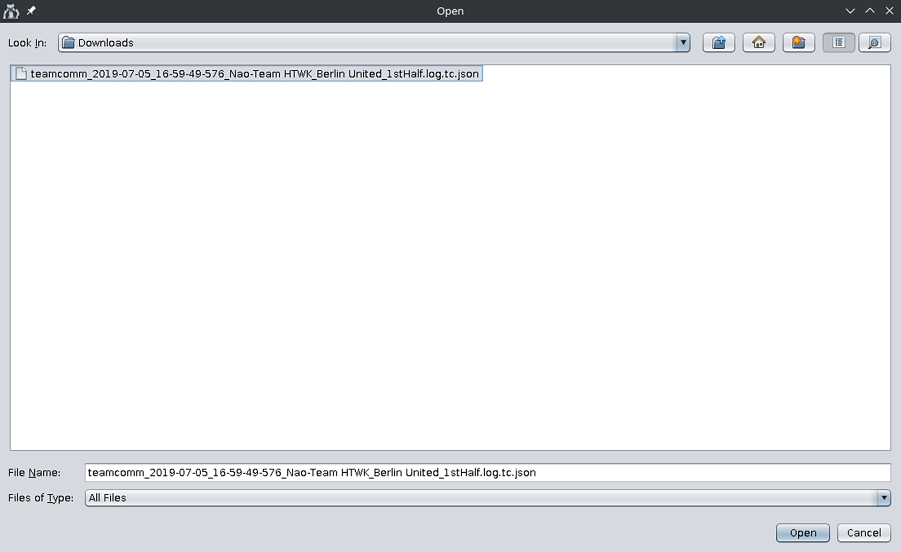
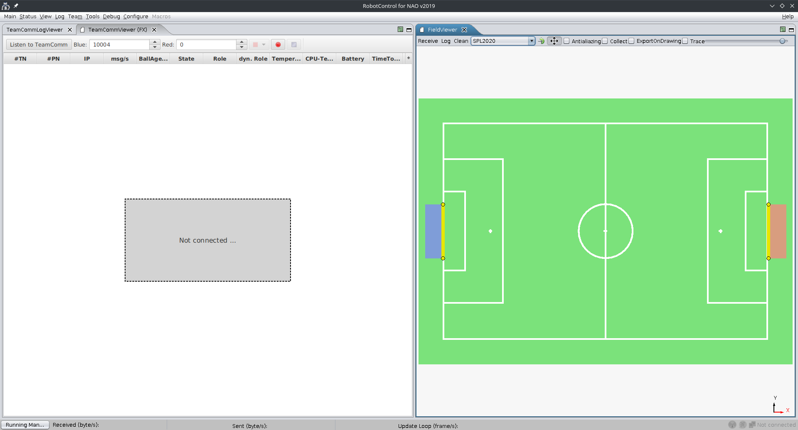
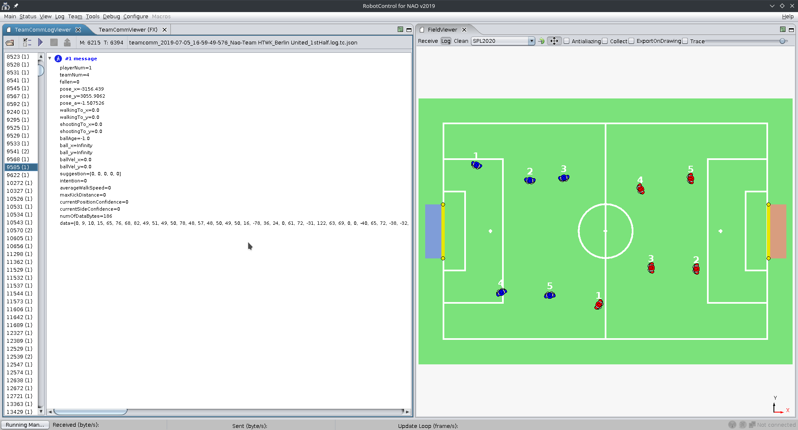

# RobotControl
RobotControl is our GUI client for the connection to the robots.
It displays data from the robot (sensor data, where the robot thinks it is, ...) and sends data to the robot (debug requests, forcing game states, ...).

!!! note
    This documentation lacks implementation details (java fx, debug communication, netbeans specific stuff, gradle)

- TODO: Move and expand RobotControl module documentation from team report.

## Starting RobotControl
RobotControl is located inside the main repository in the folder RobotControl.
It is started by running the gradlew executable inside that folder.
Because it needs Java 11, either change your system Java before execution, or, if on linux:
- Download latest JDK from [here](https://adoptium.net/en-GB/temurin/releases/?version=11&os=linux&arch=x64)
- Untar to ~/.local so that the path is `~/.local/jdk-11.0.<number>`
- Now start RobotControl with `env JAVA_HOME=~/.local/jdk-11.<number> </path/to/mainRepo>/RobotControl/gradlew`
Tipp: Set yourself an [alias](https://www.geeksforgeeks.org/alias-command-in-linux-with-examples/#how-to-create-an-aliases-persistent) for this.

## RobotControl features (aka modules)
### View
#### ImageViewer
Displays the images (top and/ or bottom camera) of a connected robot.
#### Plot2D
Receives x, y data and draws it onto a canvas. The sending of this x, y data must be compiled into the code or requested via the plot section in the module DebugRequestFX.
#### Field
Displays a field and draws the reported position of the robots into it.

### Debug
TODO

### Configue
TODO

### Log
TODO

### Status
TODO

### Tools
TODO

### Team
#### TeamCommLogs
TeamComms are what the robots broadcast. The TeamCommLogs and TeamCommLogViewer are used to display this broadcasted data from past games, so that we can see what data (e.g. coordinates) the robots reported and knew of each other.

In RobotControl open the `TeamCommLogViewer` dialogue and open a TeamComm logfile.

Open the FieldViewer and the TeamCommViewerFX dialogues next to each other. In the FieldViewer click on the log button; then in the TeamCommViewer click on the `Listen to TeamComm` button. The order here is important.

Switch back to the `TeamCommLogViewer` and click on the play button. You should see the message content of the current message on the left and on the right you can see the robots positions on the field. As those positions are as the robots report them, they show potential localization errors.

