# Visual Perception
Visual perception is the primary way for the NAO robot of perceiving its environment. To reduce computational 
complexity our vision is based on a reliable field color detection. This color information is used to estimate 
the boundaries of the visible field region in the image. Which is done while scanning for 
line edgels - oriented jumps in the brightness channel. Detection of other objects - lines, ball, 
goals - is performed within this field region. Lines are modeled as a graph of the aforementioned edgels. 
Ball detection consists mainly of two steps - key points (ball candidates) are detected using *integral image* 
and *difference of gaussians*, which are then  classified by a trained cascade classifier. Goal post detection uses scan lines along the horizon.

The image below shows the dependency graph for the vision
modules and the representations they provide, which were used at the
RoboCup 2016 competition. In the following we describe some of the
important modules in more detail.

<figure>
  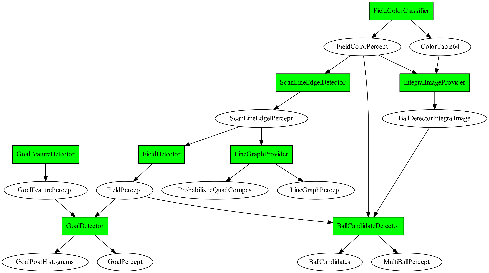
  <figcaption>
Overview over the vision system. Green boxes illustrate modules and
round nodes visualize the representations with arrows indicating the
provide-require relationships between them. 
An outgoing arrow from a module $A$ to a representation $R$ means $A$ provides $R$; an incoming
arrow from $R$ to $A$ means $R$ is required by $A$.</figcaption>
</figure>

## Green Detection
This section describes a new approach to classify the field color which has been used since late 2015. 
For the first time this approach has been presented in November 2015 at the RoHOW workshop in Hamburg, Germany.
This constitutes the first step in the attempt for a automatic field color detection. Thereby we analyze 
the structure of the color space perceived by the robot NAO and propose a simple yet powerful model for 
separation of the color regions, whereby green color is of a particular interest.

<figure>
  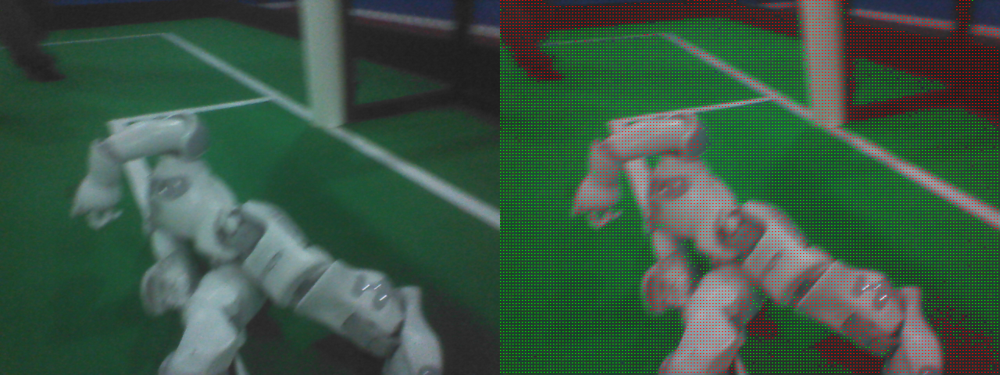
  <figcaption>
(left) Example image from the Iran Open 2015. (right) Pixels
classified as green are marked green; pixels with too low chroma marked
red;
</figcaption>
</figure>

To illustrate our findings we utilize a sequence of images from recorded
by a robot during the Iran Open 2015. The left image above is a representative image from
this sequence. 

To analyze the coverage of the color space we calculate
two color histograms over the whole image sequence. In the
Figure [4.6](#fig:green-hist){reference-type="ref"
reference="fig:green-hist"} (left) you can see the uv-histogram, which
is basically a projection of the yuv-space onto the uv-plane. The light
green points indicate the frequency of a particular uv-value (the
brighter the more). One can clearly recognize three different clusters:
white and gray colors in the center; green cluster oriented towards the
origin; and a smaller cluster of blue pixels in the direction of the
u-axis which originate from the boundaries around the field. For the
second histogram we choose a projection plane along the y-axis and
orthogonal to the uv-plane which is illustrated in the
Figure [4.6](#fig:green-hist){reference-type="ref"
reference="fig:green-hist"} (left) by the red line. This plane is chosen
in a way to illuminate the relation between the gray cluster in the
center and the green cluster.
Figure [4.6](#fig:green-hist){reference-type="ref"
reference="fig:green-hist"} (middle) illustrates the resulting
histogram. Here we clearly see the gray and the green cluster.

<figure>
  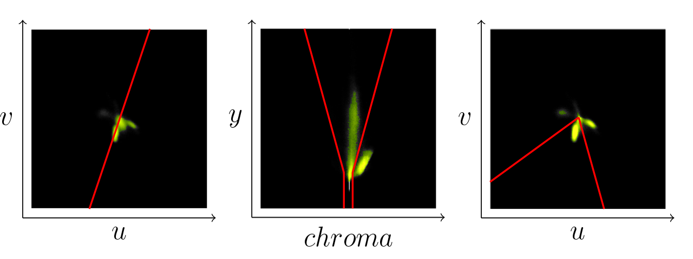
  <figcaption>
(left) UV-histogram for a log file taken
at the Iran Open 2015. Red line illustrates the projection plane along
the green region for the Y-Chroma histogram (middle); (middle)
Y-Chroma-histogram along the projection plane illustrated in (left)
figure. Red lines illustrate the gray-cone, i.e., area with not enough
color information to be classified as a particular color; (right)
UV-Histogram without pixel falling into the gray-cone as illustrated in
the (middle) figure. Red lines illustrate the segment to be classified
as green.
</figcaption>
</figure>

From these two histograms we can make following observations: all colors
seem to be concentrically organized around the central brightness axis ,
i.e., gray axis $(128,128,y)$, which corresponds to the general
definition of the yuv-space; the colors seem to be pressed closer to the
gray axis the darker they are. In particular all colors below a certain
y-threshold seem to be collapsed to the gray axis. So we can safely
claim that for a pixel $(y,u,v)$ always holds $y=0 \Rightarrow u,v=128$.
On the contrary the spectrum of colors gets wider with the rising
brightness. Speculatively one could think that the actual space of
available colors is a hsi-cone fitted into the yuv-cube. The collapse of
the colors towards the gray axis might be explained by an underlying
noise reduction procedure of the camera.

Based on these observations we can divide the classification in two
steps: (1) separate the pixels which do not carry enough color
information, i.e., these which are too close to the gray axis.
Figure [4.6](#fig:green-hist){reference-type="ref"
reference="fig:green-hist"} (middle) illustrates a simple segmentation
of the gray pixels with a cone around the center axis illustrated by the
red lines; (2) classify the color in the projection onto the uv-plane.
Figure [4.6](#fig:green-hist){reference-type="ref"
reference="fig:green-hist"} (right) shows the uv-histogram without the
gray pixels. Red lines illustrate the separated uv-segment which is
classified as green. This way we ensure independence from brightness.
The equation [\[eq:green\]](#eq:green){reference-type="ref"
reference="eq:green"} illustrates the three conditions necessary for a
pixel $(y,u,v)$ to be classified as green. The five parameter are
$b_o\in[0,255]$ the back cut off threshold, $b_m, b_M\in [0,128]$ with
$b_m<b_M$ the minimal and the maximal radius of the gray cone, and
finally $a_m,a_M\in[-\pi, \pi]$ defining the green segment in the
uv-plane.

$$
\begin{aligned}
(u-128)^2 + (v-128)^2 &> \max\left(b_m, b_m + (b_M - b_m)\cdot\frac{y - b_o}{255 - b_o} \right) \\
\text{atan2}(u-128, v-128) &> a_m \\
\text{atan2}(u-128, v-128) &< a_M
\label{eq:green}
\end{aligned}
$$

The classification itself doesn't require an explicit calculation of
histograms. At the current state it's a static classification depending
on five parameters to define the separation regions for the gray and
green colors. These parameters can be easily adjusted by inspecting the
histograms as shown in the
Figure [4.6](#fig:green-hist){reference-type="ref"
reference="fig:green-hist"} and have proven to be quite robust to local
light variation.

The structure of the color space depends of course largely on the
adjustments of the white balance. We suspect a deviation from a perfect
white balance adjustment results in a tilt of the gray cluster towards
blue region if it's to cool and towards red if it's too warm. The tilt
towards blue can be seen in the
Figure [4.6](#fig:green-hist){reference-type="ref"
reference="fig:green-hist"} (middle). This might be a queue for an
automatic white balance procedure which would ensure an optimal
separation between colored and gray pixels. The green region shifts
around the center depending on the general lighting conditions, color
temperature of the carpet and of course white balance. In the current
example the green tends rather towards the blue region. Tracking these
shifts might be the way for a fully automatic green color classifier
which would be able to cover the variety of the shades to enable a robot
to play outside.

## ScanLineEdgelDetector

<figure>
  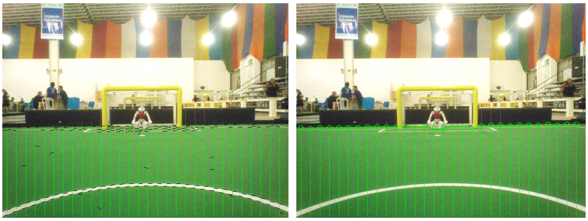
  <figcaption>
With top to down scanlines [green lines] the edges of possible
field lines [black lines] including their orientation are detected
(left) and the last field colored points are assumed as endpoints of the
field [green circles] (right).
</figcaption>
</figure>

With this module we detect field line border points and estimate some
points of the field border. To do this, we use scanlines, but only
vertical ones. Along every scanline jumps are detected in the Y channel,
using a 1D-Prewitt-Filter. A point of the field lines border is located
at the maximum of the response of that filter. We estimate with two
3x3-Sobel-Filters (horizontal and vertical) the orientation of the line.
With the result of the field color classification we detect along every
scanline a point, which marks the border of the field.

## FieldDetector

With the field border points, estimated with the
*ScanLineEdgelDetector*, we calculate for each image a polygon, which is
representing the border of the field in the image.

<figure>
  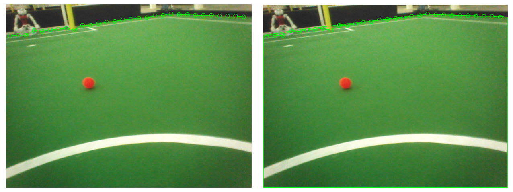
  <figcaption>
The endpoints provided by the ScanLineEdgelDetector (left) are used
to calculate the field border (right).
</figcaption>
</figure>

## LineGraphProvider

This module clusters neighbouring line border points, detected by
*ScanLineEdgelDetector*.

<figure>
  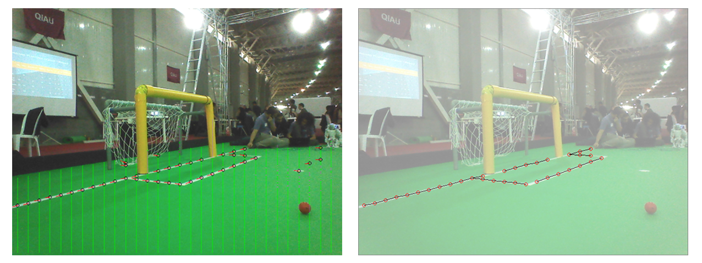
  <figcaption>
TODO: write a caption here
</figcaption>
</figure>

## RansacLineDetector

This module detects lines on the directed points generated by the
LineGraphProvider using the Random sample consensus (RANSAC) method. Our
implementation can be summarized by the following 4 steps.

1.  We pick two random directed points with a similar orientation to
    form a model of the Line. This will be a line candidate.

2.  We count the inliers and outliers of the model. A point is marked as
    an inlier, if it is close to the line and has a similar direction.
    We accumulate the error of the distance for later validation.

3.  If a model has a sufficient amount of inliers, it may be considered
    as a valid line. We repeat the above steps for a number of
    iterations and continue with the best model according to the amount
    of inliers and the smallest error in distance.

4.  Finally, we determine the endpoints of the line. We choose them as
    the maximum and minimum x and y values of the inliers. If the length
    of the line is sufficient, a field line is returned.

In order to detect the remaining field lines we repeat this procedure on
the remaining outliers until no lines are found.

## GoalFeatureDetector

This module is the first step of the goal post detection procedure. To
detect the goal posts we scan along the horizontal scan lines parallel
to the artificial horizon estimated in *ArtificialHorizonProvider*.
Similar to the detection of the field line described in
Section [4.2](#s:ScanLineEdgelDetector){reference-type="ref"
reference="s:ScanLineEdgelDetector"} we detect edgels characterized by
the jumps in the pixel brightness. These edgels are combined pairwise to
goal features, which are essentially horizontal line segments with
rising and falling brightness at the end points.
Figure [4.8](#fig:GoalFeatureDetector){reference-type="ref"
reference="fig:GoalFeatureDetector"} illustrates the scan lines as well
as detected edgels (left) and resulting goal post features (right).

<figure>
  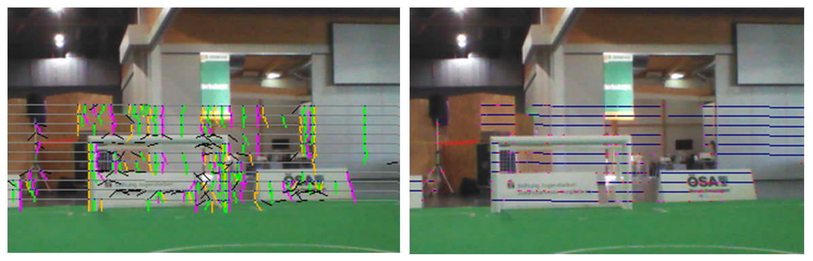
  <figcaption>
The scan lines [grey lines] above and below the estimated horizon
are used to detect the goal post border points and the orientation of
the corresponding edges [colored and black segments] (left). The
results are features of possible goal posts [blue line segments with
red dots]
(right).
</figcaption>
</figure>

## GoalDetector

The *GoalDetector* clusters the features found by the
*GoalFeatureDetector*. The main idea here is, that features, which
represent a goal post, must be located underneath of each other. We
begin with the scan line with the lowest y coordinate and go through all
detected features. Then the features of the next scan lines (next higher
y coordinate) are checked against these features. Features of all scan
lines, which are located underneath of each other, are collected into
one cluster. Each of these clusters represents a possible goal post.

<figure>
  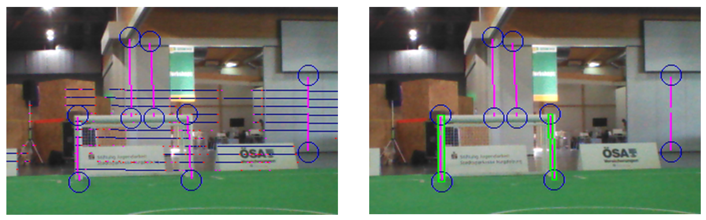
  <figcaption>
Goal features detected as described in
[4.6](#s:GoalFeatureDetector){reference-type="ref"
reference="s:GoalFeatureDetector"} are clustered to form candidates for
the goal posts (left). These candidates are evaluated regarding expected
dimensions as well as their relation to the field. The candidates
fulfilling all necessary criteria are selected as goal post percepts
(right green boxes).
</figcaption>
</figure>

From the features of a cluster, the orientation of the possible goal
post is estimated and used to scan up and down along the estimated goal
post. This is done to find the foot and the top point of that goal post.
A goal post is seen as valid, if its foot point is inside of the field
polygon as described in the
Section [4.3](#s:FieldDetector){reference-type="ref"
reference="s:FieldDetector"}. Using the kinematic chain the foot point
is projected into the relative coordinates of the robot. Based on this
estimated position the expected dimensions of the post are projected
back into the image. To be accepted as a goal post percept a candidate
cluster has to satisfy those dimensions, i.e., the deviation should not
exceed certain thresholds. The
Figure [4.10](#fig:GoalDetector){reference-type="ref"
reference="fig:GoalDetector"} illustrates the clustering step and the
evaluation of the candidate clusters. Although there seem to be a
considerable amount of false features, both posts of the goal are
detected correctly.

## Black&White Ball Detection

In 2015 the standard ball used in competitions changed to a black&white
foam ball as illustrated in
Figure [4.13](#fig:bw-ball){reference-type="ref"
reference="fig:bw-ball"}. Detection of such a ball in the SPL setup
poses a considerable challenge. In this section we describe our strategy
for detecting a black&white ball in a single image and the lessons
learned.

Given an image from the robot camera the whole approach is basically
divided into two steps: finding a small set of suitable candidates for a
ball by a fast heuristic algorithm, and classifying the candidates
afterwards with a more precise method.

<figure>
  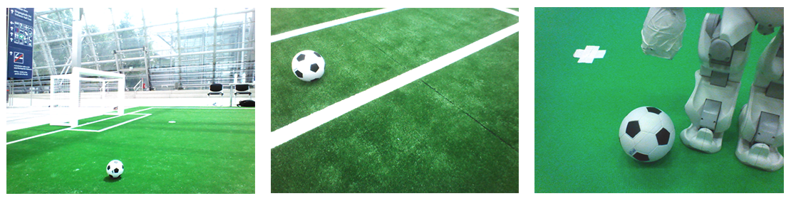
  <figcaption>
Examples of the black&white as seen by the
robot.
</figcaption>
</figure>

### Candidate Search -- Perspective Key Points Detection {#s:ball:candidate}

Properties of the ball as an object that can be assumed as known include

-   it has a fixed size;

-   it has a round shape (symmetrical shape);

-   it is black and white (so it does not contain other colors);

-   the pattern is symmetric;

These properties have some implications on the appearance of the ball in
a camera image:

-   knowing the pose of the camera we can estimate the balls size in the
    image;

-   it mostly does not contain other colors than black and white (chroma
    is low). Note: beware of reflections;

-   looking only at the color distribution we can assume it's rotation
    invariant;

Having the limited computational resources in mind, we are looking now
for following three things:

1.  a simple object representation for a ball in image;

2.  an effective and easy to calculate measure quantifying the
    likelihood such object to represent an actual ball;

3.  a tractable algorithm to find a finite set of local minimas of this
    measure over a given image (these minimal elements we then call
    candidates);

##### Representation:

In our case we define a *ball candidate* (more general a *key point*) as
a square region in the image which is likely to contain a ball. Such a
key point $c = (x,y,r)$ can be described by its position in the image
$(x,y)$ and its side radius (half side length) $r$. Basically we
represent a circular object by the outer square (bounding box) enclosing
the circle. This leads to a vast number of possible candidates in a
single image and a necessity for an efficient heuristic algorithm to
find the most likely ones.

##### Measure:

Intuitively described, a *good* key point is much brighter inside than
on its outer border. For a key point $c = (x,y,r)$ we define its
*intensity value* $I(c)$ by

$$I(c): = \frac{1}{4r^2}\sum_{i,j = x-r}^{x+r} Y(i,j)$$ 

where $Y(j,i)$
is the $Y$-channel value of the image at the pixel $(i,j)$. For the
intensity of the outer border around $c$ with the width $\delta > 0$
holds $I(c_\delta) - I(c)$, with $c_\delta:= (x,y,r\cdot(1+\delta))$.
Now we can formulate the measure for $c$ by

$$V(c): = I(c) - (I(c_\delta) - I(c)) = 2\cdot I(c) - I(c_\delta)$$ 

This measure function can be calculated very effectively using integral
images. Figure [4.17](#fig:bw-patch-function){reference-type="ref"
reference="fig:bw-patch-function"} (left) illustrates the measure
function for the valid pixels of the image.

##### Finding the local maxima:
To save resources the search is performed only within the estimated
field region (cf. Section [4.3](#s:FieldDetector){reference-type="ref"
reference="s:FieldDetector"}). For a given point $p = (i,j)$ in image we
estimate the radius $r_b(i,j)$ that the ball would have at this point in
the image using the camera matrix. This estimated radius is used to
calculate the measure function at this point:
$V(p):= V((i,j,r_b(i,j)))$. Currently we only consider points at which
the ball would be completely inside the image. The following algorithm
illustrates how the local maxima of this function are estimated:

<figure>
  
  <figcaption>
</figcaption>
</figure>

The basic idea is to keep only the key points with higher value than any
other overlapping key points, i.e., the one with the highest value in
it's neighborhood. To generate the list of *possible key points* we
iterate over the image and generate key points for each pixel. Of course
a number of heuristics is used to make the process tractable. In
particular we only consider every 4th pixel and only if it is within the
estimated field region. The list of local maxima is also limited to 5
elements - the list is kept sorted and any additional key points with
lower value are discarded.

Figure [4.17](#fig:bw-patch-function){reference-type="ref"
reference="fig:bw-patch-function"} (right) and
Figure [4.21](#fig:bw-patches){reference-type="ref"
reference="fig:bw-patches"} illustrate the detected best 5 local maxima
of the measure function.

<figure>
  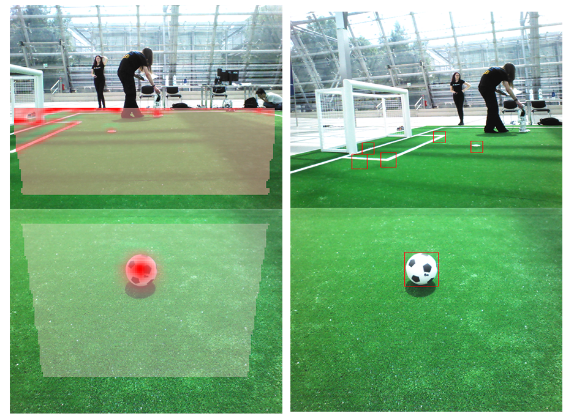
  <figcaption>
  Illustration of the value function for finding the ball key points.
Semitransparent overlay illustrates the searched area. Intensity of the
red color shows the value
function.
</figcaption>
</figure>

<figure>
  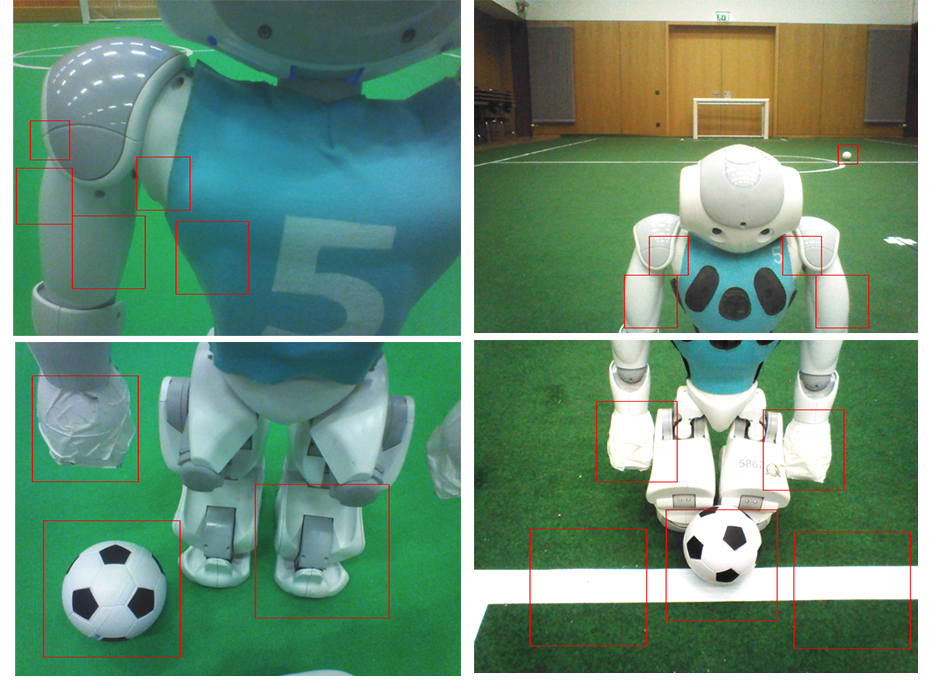
  <figcaption>
  Illustration of detected key points in the situations where the ball
is close to the robot or overlapping with the line.
</figcaption>
</figure>

### Classification

In the previous section we discussed how the number of possible ball
candidates can be efficiently reduced. At the current state we consider
about 5 candidates per image. In general these candidates look very ball
alike, e.g., hands or feet of the robots, and cannot be easily
separated. To solve this we follow the approach of supervised learning,
which mainly involves collecting positive and negative samples, and
training a classifier. In the following we outline our approach for fast
collection of the sample data and give some brief remarks about our
experience with the OpenCV Cascade Classifier which we used during the
RoboCup competition in 2016.

#### Sample Data Generation

Collecting sample data basically involves two steps: collecting images
from game situations and labeling the ones containing the ball. This can
be a very tedious and time consuming task. To simplify and accelerate
the process we collect only the candidate patches calculated by the
algorithm in Section [4.8.1](#s:ball:candidate){reference-type="ref"
reference="s:ball:candidate"}. This allows to collect the data during a
competition game at full frame rate. This however produces a vast amount
of data to be labeled. Because the patches are quite small (we
experimented with sizes between $12px\times 12px$ and
$24px\times 24px$), a large number of patches can be presented and
reviewed at once.
Figure [4.23](#fig:bw-ball-labeling){reference-type="ref"
reference="fig:bw-ball-labeling"} illustrates two examples of the
labeling interface. Patches are presented in pages consisting of a
$10\times10$ matrix. Labels can be applied or removed simply by clicking
with the mouse at a particular patch.

<figure>
  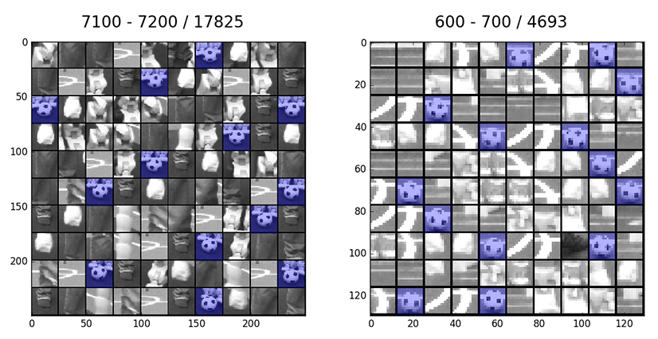
  <figcaption>
  Examples of the labeling interface. Patches are presented in pages
consisting of a $10\times10$ matrix. Labels are applied or removed by a
mouse click at a particular
patch.
</figcaption>
</figure>

#### Classification with Convolutional Neural Networks

In the last step the generated ball candidates (patches) are classified.
At the current point we distinguish two classes: `ball` and `noball`. As
a classifier we use a Convolutional Neural Network (CNN). The weights of
the network are trained in MatLab with the help of the *Neural Network
Toolbox*. The resulting network is exported with our custom export
function `createCppFile.m` to optimized hard coded implementation of the
network in C++. The generated files are included in the project and
directly used by the ball detector. All corresponding functions can be
found in the directory `Utils\MatlabDeepLearning`. Example of the
resulting classification can be found in .

<figure>
  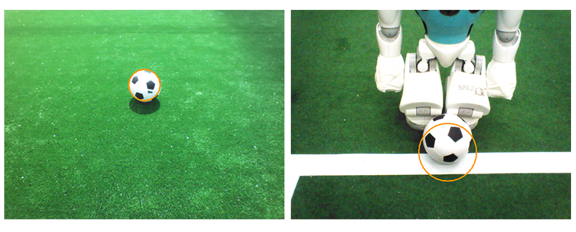
  <figcaption>
Examples of the detected
ball.
</figcaption>
</figure>

### Acknowledgment
Some of the most important parts of this ball detection procedure were
inspired by very fruitful discussions with the RoboCup community. At
this point we would like to thank in particular the team NaoDevils for
providing their trained CNN classifier during the RoboCup 2017
competition. This classifier is included in our code base and can be
used for comparison purposes. It can be found in\
`...\VisualCortex\BallDetector\Classifier\DortmundCNN`.
